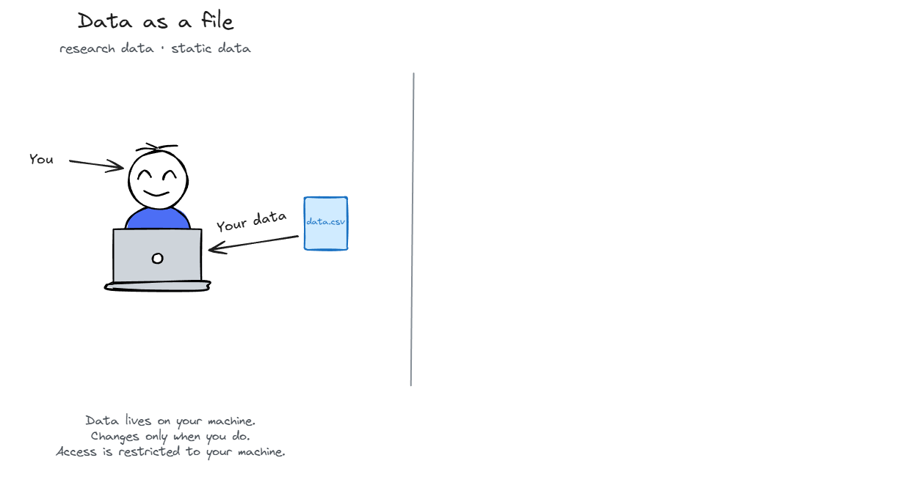
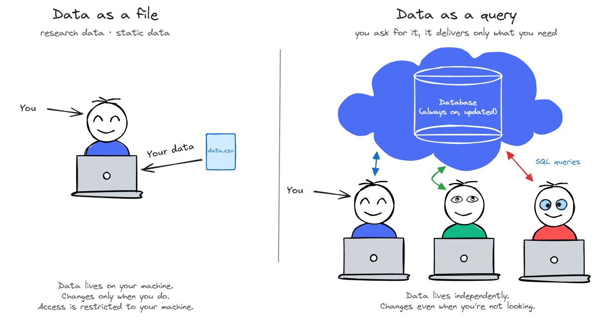
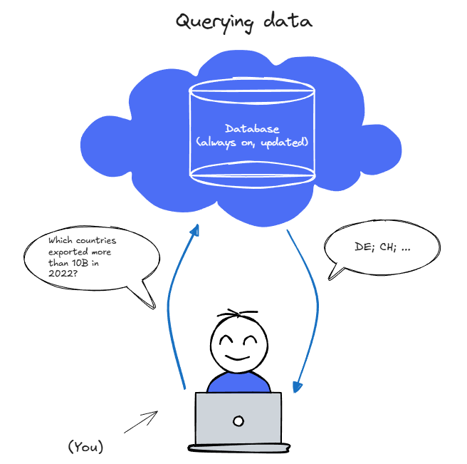
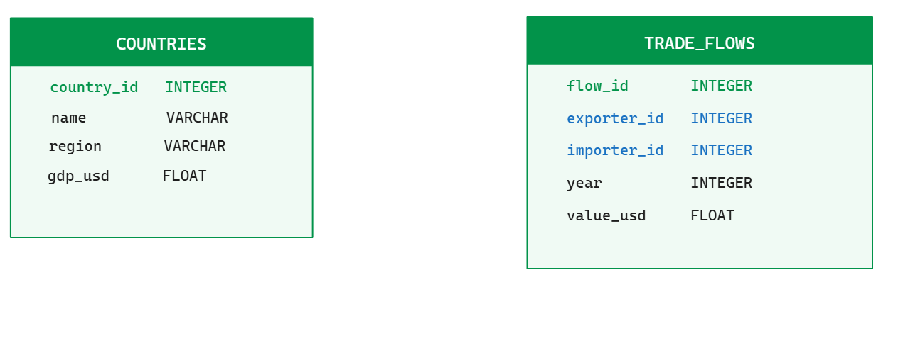
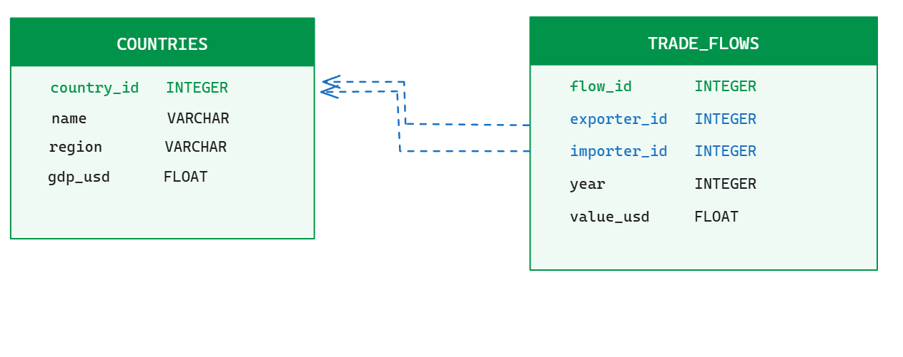
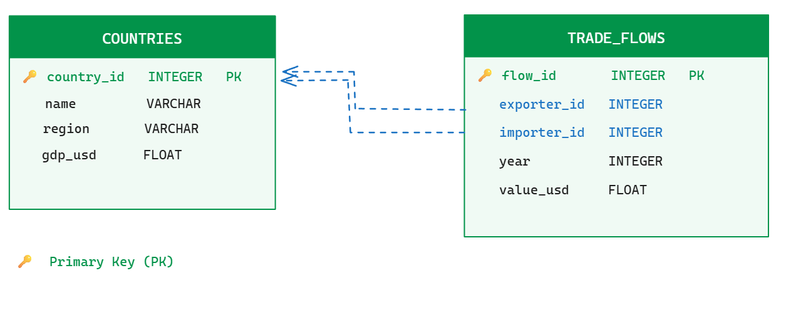
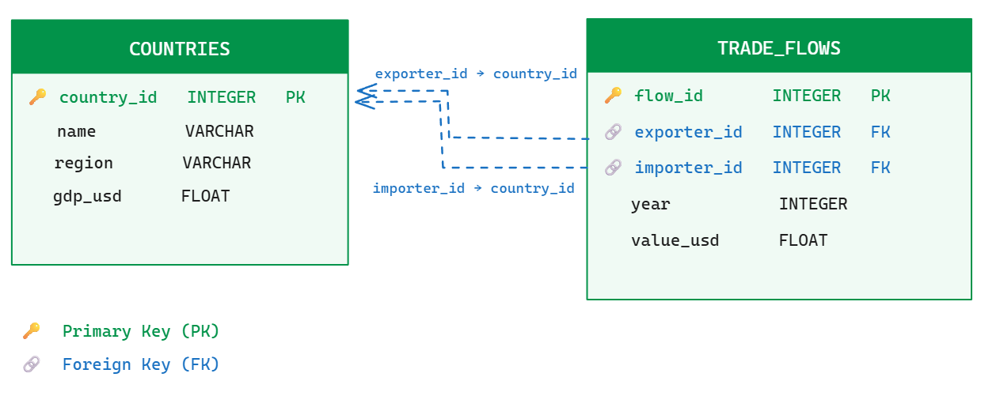
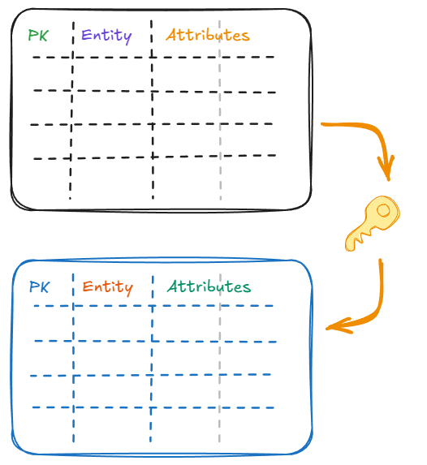
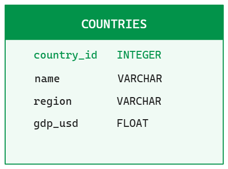
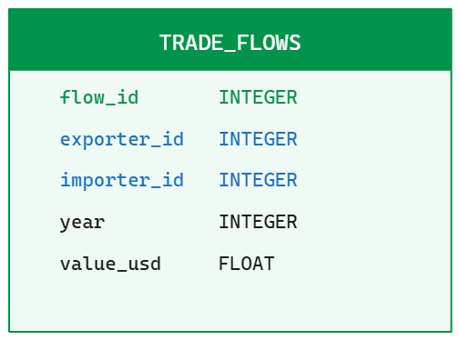

## Two ways to look at data

{fig-align="center" width="100%"}


## Two ways to look at data

{fig-align="center" width="100%"}

::: {.notes}
The key difference is not just where the data lives, it is how you access it.

With a file, you load everything into memory: `pd.read_csv("data.csv")` pulls the entire dataset into RAM. That works fine for a 10 MB file. It breaks when your dataset is 50 GB — you simply run out of memory.

With a database, you send a query and get back only the rows and columns you asked for. The database does the filtering on disk, before anything reaches your machine. Your RAM only ever sees the result, not the raw data.

This is the fundamental shift: from "give me everything, I'll figure it out" to "I know exactly what I want, give me that."

The other consequence: because the data lives independently on a server or a file on disk, multiple people can query it at the same time. It doesn't belong to any one session. That's what makes it a "service" — and also what makes it the right tool for shared, live, or large data.
:::

<!--
Notes from Matter, pages 124 -
- use stand-alone databases when: data is large and must be stored efficiently (i.e. on disk, not in memory), data is relational (multiple tables linked by keys), and/or multiple people need to access the same data
- use databases when data is not static — when it is updated frequently, or when you need to ensure data integrity and consistency over time

relational data model: data is organized into tables (relations) with rows (tuples) and columns (attributes). Tables are linked through keys (primary and foreign keys). This model allows for efficient storage, querying, and maintenance of data integrity.
RDBMS: row-based relational database management system, optimized for transactional workloads (OLTP). Examples: MySQL, PostgreSQL, SQLite. Not ideal for analytical queries over large datasets.
made for storing clean data in clearly defined set of tables, with defined properties.  Rows are indexed according to unique identifiers. Good for business data (transactions), not for analytics.

NoSQL: column-based, document-based, key-value based or graph-based models. Optimized for horizontal scaling, optimized to give quick answers based on summarizing large amounts of data.


relational data bmodel:

- dataset split by columns into tables to reduce the storage of redundant data and to maintain data integrity. Linked through keys. Efficient storage. Key columns are indexed
## Two ways to look at data
-->


## Two ways to look at data

:::: {.columns style="font-size: 0.85em;"}
::: {.column width="50%"}
#### **Data in memory**: pandas, (polars), dplyr
:::
::: {.column width="50%"}
#### **Data in a database**: SQL
:::
::::

:::: {.fragment .columns style="font-size: 0.85em;"}
::: {.column width="50%"}
- You load data into RAM and manipulate it with code
:::
::: {.column width="50%"}
- You send **queries** to a database, which returns only what you ask for
:::
::::

:::: {.fragment .columns style="font-size: 0.85em;"}
::: {.column width="50%"}
- The data **lives in memory**, temporary, on RAM
:::
::: {.column width="50%"}
- The data **lives in a database**, persistent, on disk or in the cloud
:::
::::

:::: {.fragment .columns style="font-size: 0.85em;"}
::: {.column width="50%"}
- Size is small and can fit in memory
:::
::: {.column width="50%"}
- Large datasets that don't fit in memory
:::
::::

:::: {.fragment .columns style="font-size: 0.85em;"}
::: {.column width="50%"}
- You work on the whole dataset at once
:::
::: {.column width="50%"}
- You operate on "parts/subsets" of the data through querying
:::
::::

:::: {.fragment .columns style="font-size: 0.85em;"}
::: {.column width="50%"}
- For statistical analysis, plotting, typical data workflow in research, small projects
:::
::: {.column width="50%"}
- For data that needs to stay consistent over time, for data that is updated frequently, for data that is shared across multiple users/systems, for production applications
:::
::::


## Goals for the next two weeks

#### CONSTRUCT a database

- understand why databases exist and what problem they solve
- know the relational model: tables, rows, keys, relationships

#### QUERY the database

- write our first simple SQL queries with DuckDB
- make more complex queries with JOINs, Groupings, subqueries, and CTEs (next week)


> **Note:** If we can't cover everything today, we will cover the rest next week. Slides marked with 👓 are slides that I will skip in the lecture if time is short, but that you should read at home.


# What is a database?

## What is a database?

<div style="margin-top: 1em;"></div>

Every app, every service, every research dataset you interact with is backed by a database.

<div style="margin-top: 1em;"></div>

:::: {.columns}

::: {.column width="50%"}

#### Structured data

- Customer records (name, address, country)
- Trade flows (year, exporter, importer, value)
- Survey responses (respondent\_id, question, answer)

:::

::: {.column width="50%"}

#### Unstructured data

- Text, emails, news articles
- Images, audio, video

:::

::::

<div style="margin-top: 1.5em;"></div>

##### A database is an organized collection of data.

::: {.notes}
In the case of structured data, the organization is based on the relational model, which we will cover in a moment. In the case of unstructured data, the organization can be more flexible, but it still relies on some form of indexing and metadata to allow for efficient retrieval. For instance, data lakes or document databases store unstructured data but still have a way to query it based on metadata or content.
:::


## Managing databases

##### A **Database Management System (DBMS)** is the software that sits between you and the data.

:::: {.columns}

::: {.column width="55%"}

<div style="margin-top: 1em;"></div>

- You send it a query: *"Which countries exported more than 10B in 2022?"*
- It returns the answer.

You never touch or manipulate the raw data directly. The DBMS handles storage and access. It serves you the data "on a silver platter".

:::

::: {.column width="45%"}

<div style="margin-top: -1em;"></div>

{width="90%"}

:::

::::


## Why use a DBMS?

Three elements are needed from your databases:

<!--Think of any firm: a bank, an insurer, an online shop. Or think of large data for your master's thesis on your own computer.-->

<div style="margin-top: 0.5em;"></div>

:::: {.columns style="font-size: 0.72em;"}

::: {.column width="33%"}

#### 1. Data independence & integrity

Many people/systems read and write the same data. **Data must stay correct** regardless of who touches it.

- Abstract view. No one touches raw storage
- Constraints enforce consistency automatically
- No conflicting CSV versions, no overwrites

:::

::: {.column width="33%"}

#### 2. Simple, efficient access

Apps, dashboards, and analysts all need to **extract data quickly**, without knowing where or how it is stored.<br>

- **SQL** is the standard interface across all databases
- The **query optimizer** decides *how* to run your query. You just say *what* you want.

:::

::: {.column width="33%"}

#### 3. Governance & reliability

The system **cannot break down** (no failed transaction, a lost record, a data breach).<br><br>

- The database protects the data in case of problems.

:::
::::


> **Note:** Check the [🔎 Self-Study](#sec-acid) for the ACID properties: the four guarantees that keep database transactions reliable.


# The relational model

## Data lives in tables

##### The fundamental idea of *relational* databases: data is organized into **relations** (tables).

<div style="margin-top: 1em;"></div>

{width="90%"}


## Data lives in tables

##### The fundamental idea of *relational* databases: data is organized into **relations** (tables).

<div style="margin-top: 1.4em;"></div>

Each table/relation has:

- A **(relation) schema**: the table name, column names, and their types (or domain)
- **Columns** (attributes): one variable per column
- **Rows** (records / tuples): one entry per observation

We can write the relation schema as:

```
Table(attribute_1: INT, attribute_2: VARCHAR, ...)
```

> Check the [🔎 Self-Study](#sec-terminology) for a quick note on the terminology of the relational model.


## Data lives in tables

##### The fundamental idea of *relational* databases: data is organized into **relations** (tables).

<div style="margin-top: 1em;"></div>

{width="90%"}

```
Countries(country_id: INT, name: VARCHAR, region: VARCHAR, gdp_usd: FLOAT)
Trade_flows(flow_id: INT, exporter_id: INT, importer_id: INT, year: INT, value_usd: FLOAT)
```


## Relational databases are built on relationships

A **relational database** is a collection of relations (tables) that are linked together through **keys**.

{width="70%"}


## Relationships are built on keys

#### Primary key
- Column (or set of columns) that **uniquely identifies each row**. If two tuples agree on the value(s) of the key, then they must be the same tuple.
- It is `NOT NULL` and `UNIQUE` by definition
- It allows other tables to **refer** to this table

<div style="margin-top: 1em;"></div>

> **Note:** A good primary key is stable (never changes), unique, and meaningless on its own: a number, not the country name, which could change. If no natural attribute works as a key, you create a **surrogate key** (an artificial integer ID). When a single column isn't enough, a **composite key** combines two or more columns.


## Relationships are built on keys

#### Primary keys in our model?

{width="70%"}

<div style="height: 3em;"></div>

## Relationships are built on keys

#### Primary keys in our model?

{width="70%"}

::: {.fragment style="font-size: 0.8em;"}
- `country_id` in `Countries` is the primary key. It uniquely identifies each country.
- `flow_id` in `Trade_Flows` is the primary key for trade flows.
:::


## Relationships are built on keys

#### Foreign key
- A column (or set of columns) that refers to a primary key in another table. It creates a link between the two tables.
- Always in the referencing table (the "many" side of a one-to-many relationship)
- A **foreign key constraint** means: you cannot insert a row with a foreign key value that does not exist in the referenced table.
- This is known as **referential integrity**.


## Relationships are built on keys

#### What are the foreign keys in our model?

{width="70%"}

<div style="height: 3em;"></div>

## Relationships are built on keys

#### What are the foreign keys in our model?

{width="70%"}


::: {.fragment style="font-size: 0.8em;"}
- `exporter_id` and `importer_id` in `trade_flows` are foreign keys that **refer to** `country_id` in `countries`
- The **constraint**: you cannot insert a trade flow for a country that does not exist in `Countries`. Every trade flow must reference an existing country.
:::


## Why split data into multiple tables?

#### Yes, why?

## Why split data into multiple tables?

Imagine storing everything in one table:

<div style="font-size: 0.75em;">

| flow\_id | exporter\_name | exporter\_region | importer\_name | importer\_region | year | value |
|:--------:|----------------|-----------------|----------------|-----------------|:----:|------:|
| 1        | Switzerland    | Europe          | Germany        | Europe          | 2022 | 45M   |
| 2        | Switzerland    | Europe          | France         | Europe          | 2022 | 38M   |

</div>

<div style="margin-top: 1em;"></div>

::: {.fragment style="font-size: 0.8em;"}
- **Redundant storage**: `"Europe"` is 6 bytes; an integer ID is 4 bytes. Multiply by millions of rows, this becomes huge.
- **Update anomaly**: if Switzerland changes region, one row to fix in `countries`. In a flat table, every trade flow row is rewritten.
- **Insertion anomaly**: to add `capital_city` to Switzerland, you add one column to `countries`, and not across millions of rows.
- **Deletion anomaly**: deleting all Swiss trade flows does not delete the information that Switzerland is in Europe.
:::

::: {.fragment}
##### Split tables eliminate redundancy and keep data consistent. This is called **normalization**.
:::


# An example of relational model: the star schema

## The star schema ⭐

- Most widely used to develop data warehouses (databases optimized for analytics)
- Consists of one or more **fact tables** referencing any number of **dimension tables**.

<div style="margin-top: 1em;"></div>

:::: {.columns}

::: {.column width="50%"}
](../../assets/img/lecture_09_db/star_schema.png){width="80%"}
:::

::: {.column width="50%"}

- **Fact table** (`observations`). Long data, one row per measurement
- **Dimension tables** (`countries`, `indicators`). Metadata, usually wider because contains more attributes.
- 🔑 The fact table holds foreign keys to all dimensions
:::
::::


## The star schema ⭐

- Moves repeated metadata into separate tables and replaces strings with integer IDs. <br>-> **normalization**
- **Upside**: consistency, compactness, flexibility. **Downside**: you need JOINs to get readable labels.


:::: {.columns style="font-size: 0.7em;"}
::: {.column width="50%"}

<div style="margin-top: 3em;"></div>

**`observations`** (**fact** table with millions of rows)

| country_id | indicator_id | year | value |
|---|---|---|---|
| 3 | 1 | 2020 | 45 234 |
| 3 | 1 | 2021 | 46 100 |
| 3 | 2 | 2020 | 3.8 |
| 4 | 1 | 2020 | 38 600 |

:::
::: {.column width="50%"}

**`countries`** (**dimension** table)

| country_id | name | region |
|---|---|---|
| 3 | Germany | Europe & Central Asia |
| 4 | France | Europe & Central Asia |

<div style="margin-top: 1.75em;"></div>

**`indicators`** (**dimension** table)

| indicator_id | name |
|---|---|
| 1 | GDP per capita |
| 2 | Unemployment rate |

:::
::::


> **Note:** Check the [🔎 Self-Study](#sec-normalization) for a quick note on the star schema and normalization.


## The star schema ⭐ {background-color="black"}

We will explore a simple star schema with FRED data in the exercise session.


# Create a database<br>Step 1: design the schema

## Think in entities and relationships

Before creating a database, **sketch** the structure of your data. **Think visually** about your data structure and your schema design.

<div style="margin-top: 1.5em;"></div>

::: {.columns}
::: {.column width="60%"}
1. **Entities**: a *country*, a *firm*, a *survey respondent*, a *product*.
2. **Attributes**: the properties of each entity. In our example, each country has a name, a region, an income group.
3. **Relationships**: how entities connect with each other. <br>E.g., a trade flow *links* an exporter country to an importer country, or a survey response *belongs to* a respondent
:::
::: {.column width="40%"}
{width="60%" style="display: block; margin: -30px auto 0 auto; padding: 0;"}
:::
:::


<div style="margin-top: 1.5em;"></div>


> **Note:** The concept of "entity" is close to the idea of "unit of observation" in statistics. It is the "thing" that you are collecting data about.


## Write your schema in a simple text format first


#### For instance:

<div style="margin-top: 1.5em;"></div>

```
Countries(country_id: INT PK, name: VARCHAR, region: VARCHAR, gdp_usd: FLOAT)

Trade_flows(flow_id: INT PK, exporter_id: INT FK->Countries, importer_id: INT FK->Countries, year: INT, value_usd: FLOAT)
```

<div style="margin-top: 1.5em;"></div>

- `PK` = primary key, `FK` = foreign key
- `FK→Countries` means it references the `Countries` table
- This is an informal shorthand for sketching schemas, not a formal standard. Different textbooks use different conventions.


## Or use an ER diagram

[**Mermaid** 🧜‍♀️](https://mermaid.js.org/syntax/entityRelationshipDiagram.html) is a text-based diagram language for **entity-relationship diagrams** (ERDs), which renders directly in Quarto.

:::: {.columns}
::: {.column width="45%"}

```
erDiagram
    COUNTRIES {
        int     country_id  PK
        varchar name
        varchar region
        float   gdp_usd
    }
    TRADE_FLOWS {
        int   flow_id      PK
        int   exporter_id  FK
        int   importer_id  FK
        int   year
        float value_usd
    }
    COUNTRIES ||--o{ TRADE_FLOWS : "exports"
    COUNTRIES ||--o{ TRADE_FLOWS : "imports"
```

:::
::: {.column width="55%"}

```{mermaid}
%%| echo: false
erDiagram
    COUNTRIES {
        int     country_id  PK
        varchar name
        varchar region
        float   gdp_usd
    }
    TRADE_FLOWS {
        int   flow_id      PK
        int   exporter_id  FK
        int   importer_id  FK
        int   year
        float value_usd
    }
    COUNTRIES ||--o{ TRADE_FLOWS : "exports"
    COUNTRIES ||--o{ TRADE_FLOWS : "imports"
```

:::
::::

<div style="font-size: 0.8em;">
It uses [crow's foot notation 🐦‍⬛](https://mermaid.ai/open-source/syntax/entityRelationshipDiagram.html) to show relationships between tables: `||` = one and only one; `o{` = zero or more; etc.
</div>


## Thinking in entities and relationships

::: {.columns}
::: {.column width="50%"}

#### Once you have a sketch, translating to SQL will be easier:

- Each **entity** → one table
- Each **attribute** → one column, with a type
- Each **relationship** → a foreign key

:::
::: {.column width="50%"}
{width="80%" style="display: block; margin: -20px auto 0 auto; padding: 0;"}
:::
:::


# Create a database<br>Step 2: from sketch to schema using SQL

## SQL — **S**tructured **Q**uery **L**anguage

::: {.columns}
::: {.column}
- SQL is a **query language**.
- You describe *what* you want, and the database figures out *how* to get it.
- It is very high level, highly optimized, and has been around for decades.
- Different "**dialects**" (standards and implementations, which are incompletely compatible)
- 💪 Required skill for most data science positions in industry
:::
::: {.column}
](../../assets/img/lecture_09_db/sql_vs_squirrel.png){width="90%"}
:::
:::

> **Note:** Originally based upon relational algebra and tuple relational calculus. We won't go into details in this introductory course. I recommend Marco Venturini's lecture for more details.


## SQL — **S**tructured **Q**uery **L**anguage

<div style="margin-top: 1em;"></div>

SQL has five main parts, or five main purposes:

- **DDL** — Data Definition Language: `CREATE TABLE`, `DROP TABLE`, `ALTER TABLE`
- **DML** — Data Manipulation Language: `INSERT`, `UPDATE`, `DELETE` records
- **DQL** — Data Query Language: `SELECT`
- **DCL** — Data Control Language (authorization): `GRANT`, `REVOKE`
- **TCL** — Transaction Control Language (manages changes in transactions): `COMMIT`, `ROLLBACK`, `SAVEPOINT`, `SET TRANSACTION`

<div style="margin-top: 1em;"></div>

In this course, we'll focus on DDL, DML and DQL.


## The database universe

##### Hundreds of database products exist.

](../../assets/img/lecture_09_db/db_universe.png){fig-align="center" width="100%"}


## 👓 The most important difference among the dbms is **OLTP vs. OLAP**

<div style="margin-top: 0.5em;"></div>

:::: {.columns style="font-size: 0.85em;"}
::: {.column width="50%"}

#### OLTP: Online Transaction Processing

- One row at a time: inserts, updates, deletes
- High write frequency, strict data integrity
- Powers apps, payment systems, inventory
- **Running** the business (claims, subscriptions, inventory movements)

<!--#### PostgreSQL, MySQL, Oracle (primarily), SQLite-->
:::
::: {.column width="50%"}

#### OLAP: Online Analytical Processing

- Millions of rows at once: aggregations, joins
- Read-heavy, optimised for full-column scans
- Powers dashboards, research, reporting
- **Understanding** the business, tailored for **analytics**
- ***Data warehousing***

<!--#### DuckDB, ClickHouse, Snowflake, BigQuery-->
:::
::::

- Both have different internal architectures, optimised for different goals.
- Both have a SQL query interface.

<div style="margin-top: 1.5em;"></div>

> **Note:** See Kleppmann's *Designing Data-Intensive Applications* (O'Reilly, 2017, Chapter 3). The distinction boils down to three dimensions: **storage layout** (row-oriented vs column-oriented), **indexing strategy**, **concurrency model**.


::: {.notes}

From Kleppmann's *Designing Data-Intensive Applications* (O'Reilly, 2017, Chapter 3):

However, databases also started being increasingly used for data analytics, which has very different access patterns. Usually an analytic query needs to scan over a huge number of records, and calculates aggregate statistics (such as count, sum or average) rather than returning the raw data to the user.

At first, the same databases were used for both transaction-processing and analytic queries. SQL turned out to be quite flexible in this regard: it works well for OLTPtype queries as well as OLAP-type queries. Nevertheless, in the late 1980s and early 1990s, there was a trend for companies to stop using their OLTP systems for analytics purposes, and to run the analytics on a separate database instead. This separate database was called a data warehouse.

An enterprise may have dozens of different transaction-processing systems, for example systems powering the customer-facing website, controlling point of sale (checkout) systems in physical stores, tracking inventory in warehouses, planning routes for vehicles, managing suppliers, administering employees, etc. Each of these systems is complex and needs a team of people to maintain it, so the systems end up operating mostly autonomously from each other.

These OLTP systems are usually expected to be highly available and to process transactions with low latency, since they are often critical to the operation of the business. Database administrators therefore closely guard their OLTP databases. They are usually reluctant to let business analysts run ad-hoc analytic queries on an OLTP database, since those queries are often expensive, scanning large parts of the dataset, which can harm the performance of concurrently executing transactions.

A data warehouse, by contrast, is a separate database that analysts can query to their heart’s content, without affecting OLTP operations [41]. The data warehouse contains a read-only copy of the data in all the various OLTP systems in the company. Data is extracted from OLTP databases (using either a periodic data dump or a continuous stream of updates), transformed into an analysis-friendly schema, cleaned up, and then loaded into the data warehouse. This process of getting data into the warehouse is known as Extract-Transform-Load (ETL), and is illustrated in Figure 3-8.

Data warehouses now exist in almost all large enterprises, but in small companies they are almost unheard of. This is probably because most small companies don’t have so many different OLTP systems, and most small companies have a small amount of data — small enough that it can be queried in a conventional SQL database, or even analyzed in a spreadsheet. In a large company, a lot of heavy lifting is required to do something that is simple in a small company.

A big advantage of using a separate data warehouse, rather than querying OLTP systems directly for analytics, is that the data warehouse can be optimized for analytic access patterns. It turns out that the indexing algorithms discussed in the first half of this chapter work well for OLTP, but are not very good at answering analytic queries. In the rest of this chapter we will look at storage engines that are optimized for analytics instead.

The divergence between OLTP databases and data warehouses

The data model of a data warehouse is most commonly relational, because SQL is generally a good fit for analytic queries. There are many graphical data analysis tools which generate SQL queries, visualize the results, and allow analysts to explore the data (through operations such as drill-down and slicing and dicing).

On the surface, **a data warehouse and a relational OLTP database look similar**, because they both have a SQL query interface. However, the internals of the systems can look quite different, because they are optimized for very different query patterns. Many database vendors now focus on supporting either transaction processing or analytics workloads, but not both. Some databases, such as Microsoft SQL Server and SAP HANA, have support for transaction processing and data warehousing in the same product. However, they are increasingly becoming two separate storage and query engines, which happen to be accessible through a common SQL interface [42, 43, 44].


**Storage layout — the concrete explanation:**

Row-oriented (PostgreSQL, Oracle): data stored row by row on disk.
  [1, Switzerland, Europe, 905B]  [2, Germany, Europe, 4072B]  ...
SELECT AVG(gdp_usd) reads every full row — name, region, everything — just to get one column.

Column-oriented (DuckDB): data stored column by column.
  country_id: [1, 2, 3, ...]
  name:       [Switzerland, Germany, Brazil, ...]
  gdp_usd:    [905B, 4072B, 2081B, ...]
SELECT AVG(gdp_usd) reads only the gdp_usd column and skips the rest.

With 200 rows the difference is invisible. With 50 million rows and 100 columns, SELECT AVG(salary) reads 1/100th of the data — 100x less disk I/O.

OLTP apps need the opposite: SELECT * FROM orders WHERE order_id = 42 reads one full row. With column storage that single row is scattered across 100 files — slow.
Rule of thumb: analytics = few columns, many rows → column wins. Apps = all columns, one row → row wins.

**Oracle:**
Oracle is a row-oriented RDBMS, same category as PostgreSQL — the dominant production database in large enterprises, banks, insurance, government. Proprietary, expensive, huge enterprise ecosystem. In my work I write SQL against an Oracle data warehouse. The syntax is almost identical to what we use here — differences are in advanced features (window functions, date handling). Oracle also sells analytical add-ons (Exadata) but the core engine is row-oriented OLTP.

**Indexing strategy:**
OLTP databases build B-tree indexes on primary keys and commonly filtered columns. The goal: find one row instantly (`WHERE order_id = 42`). The cost: every INSERT, UPDATE, and DELETE must also update all relevant indexes — fine when writes are infrequent per row, painful for bulk loads.

OLAP databases do the opposite: minimal row-level indexing. Instead they rely on column compression (run-length encoding, dictionary encoding) to make full-column scans cheap, and on zone maps (min/max statistics per column chunk) to skip chunks that can't match a filter. Adding a B-tree index on every column would slow bulk loads and waste space.

**Concurrency model:**
OLTP must handle many simultaneous writers — thousands of transactions per second hitting the same rows. PostgreSQL uses MVCC (Multi-Version Concurrency Control): each transaction sees a consistent snapshot of the database without blocking readers. This is powerful but adds overhead (version chains, vacuum processes to clean old versions).

OLAP is mostly read-heavy with occasional bulk loads. DuckDB uses a simpler model: one writer at a time, many concurrent readers. Because analysts rarely write mid-query, the concurrency overhead is much lower — which is part of why DuckDB can be so fast on reads.

**Sources:**
- Kleppmann, *Designing Data-Intensive Applications* (O'Reilly, 2017) — Ch. 3 (storage layout, B-trees, column storage) and Ch. 7 (transactions, MVCC)
- Raasveldt & Mühleisen, "DuckDB: An Embeddable Analytical Data Management System", SIGMOD 2019 — the original DuckDB paper; covers the columnar engine and concurrency model
:::


## In this course...

::: {.columns}
::: {.column width="40%"}
{width="60%"}
:::

::: {.column width="60%"}
##### ... we will use **DuckDB**

<div style="margin-top: 1em;"></div>

- built for analytics and research
- column-oriented, with a simple concurrency model (one writer, many readers)
- optimized for analytical queries, aggregations, reads
- embedded (runs inside Python/R, no server)
- open source, free, and easy to set up: `uv add duckdb`
- Reads CSV, Parquet, JSON directly
- One [db]{.path} file, shareable
:::
:::


## We will use DuckDB as DBMS

- DuckDB is usable from Python and R. The [project.db]{.path} file can be accessed from both.
- A typical **workflow** 🔄 : create a connection to a [project.db]{.path} file, create tables, query, get results, then close the connection.


:::: {.columns}
::: {.column width="50%"}
**Python**
```python
import duckdb

# Open (or create) a .db file
conn = duckdb.connect("project.db")

# Query → pandas DataFrame
df = conn.execute("""
    SELECT name, gdp_usd
    FROM   countries
    WHERE  region = 'Europe'
    ORDER BY gdp_usd DESC
""").df()

conn.close()
```
:::
::: {.column width="50%"}
**R**
```r
library(duckdb)
library(DBI)

# Open (or create) a .db file
con <- dbConnect(duckdb(), "project.db")

# Query → data.frame
df <- dbGetQuery(con, "
    SELECT name, gdp_usd
    FROM   countries
    WHERE  region = 'Europe'
    ORDER BY gdp_usd DESC
")

dbDisconnect(con, shutdown = TRUE)
```
:::
::::


# Create a database<br>Step 3: ETL

## Use the companion python script {background-color="black"}

It contains all the code to create the database and run queries.

## OLTP, OLAP, and the ETL pipeline

.pdf)](../../assets/img/lecture_09_db/oltp_olap_kleppmann.png){fig-align="center" width="50%"}

Data is extracted from OLTP databases, transformed into an analysis-friendly schema, cleaned up, and then loaded into the *data warehouse*.

##### This process is known as *Extract-Transform-Load (ETL)*


## Extract-Transform-Load (ETL)

A common pipeline that fits well with the type of work we do in (Econ) research.

<div style="margin-top: 1em;"></div>

<div style="font-size: 0.8em;">
| Step | What happens | Tool |
|---|---|---|
| **Extract** (for Economists) | Read raw data from its source, often messy and wide format | `pandas`, `fredapi`, CSV, an app, a survey |
| **Extract** (production, industry) | Extract from OLTP databases | |
| **Transform** | Clean, reshape, tidy data, assign IDs | `pandas` |
| **Load** | Insert into the database (*warehouse*), give it structure and queryable | SQL `INSERT` |

</div>

::: {.aside}
Source: [ETL](https://en.wikipedia.org/wiki/Extract,_transform,_load)
:::


## 👓 The ETL pipeline

**Why not load raw data directly into a database?**

- Raw data is often wide, messy, missing IDs
- SQL has no `melt()`, no (advanced) cleaning
- pandas or tidyverse/data.table in R are the right tool for reshaping

**Why separate the raw data from the data warehouse?**

- Database is optimized for analytic access
- No interference with the operation of the business


## Conduct the Extract and Transform in python {background-color="black"}

Use the companion script.


# Create a database<br>Step 4: create tables and load data


## Building a database is a two-step process

1. 🦴 Set up the **architecture** of the data through a data model.

    - Use SQL to create tables, define columns, and set constraints.
    - This is the "skeleton" of your database, the structure that holds your data together.

<div style="margin-top: 1em;"></div>

2. Populate/**Load** the model with the **transformed** data (ETL)

    - Use python/R to clean and reshape your raw data, assign IDs, and prepare it for loading.
    - Use SQL `INSERT` statements to add rows to your tables.


## CREATE our first TABLE

- Creating a table means defining its **schema**: the column names, their types, and any constraints.
- The schema is self-documenting: anyone reading it knows the rules.

It follows a simple syntax:

```sql
CREATE TABLE <table name> (
    <var name>  <var type> <constraint> ,
    <var name>  <var type> <constraint> ,
    ...
);
```
<div style="margin-top: 1em;"></div>


## Atomic data types in SQL

  - The SQL standard defines a core set of data types.
  - Each dialect has its own extensions, but these are the most common:
    - **Characters**: `VARCHAR[(length)]` (Variable-length string, max n)
    - **Numeric**: `INTEGER`/`INT` (four-byte integers), `BIGINT` (64-bit integers), `SMALLINT` (16-bit integers), `FLOAT` (approximate floating-point), `DECIMAL(p, s)` (Exact fixed-point number with precision p and scale s) <!-- Example: DECIMAL(10, 2) stores up to 10 digits total, 2 of which are after the decimal — so values like 12345678.99 -->
    - **Others**: `DATE`, `TIME`, `DATETIME`/`TIMESTAMP`, `INTERVAL`, `BOOLEAN`

> **Note:** `FLOAT` is used in this course for simplicity. For monetary values in production, prefer `DECIMAL(p, s)` to avoid floating-point rounding errors (e.g. `DECIMAL(20, 2)`). Refer to the documentation of each SQL dialect for the full list of supported types.


## SQL constraints

Constraints enforce rules on your data at the database level. They are optional (but highly recommended to ensure data integrity and consistency).

<div style="margin-top: 1em;"></div>

<div style="font-size: 0.8em;">

| Constraint | What it does |
|---|---|
| `NOT NULL` | Column must always have a value |
| `UNIQUE` | No two rows can share the same value |
| `PRIMARY KEY`* | NOT NULL + UNIQUE: the row's unique identifier |
| `FOREIGN KEY` | Value must exist in another table |
| `CHECK` | Custom condition, e.g. `CHECK (gdp_usd >= 0)` |
| `DEFAULT` | Auto-fills a value when none is provided |

</div>

<div style="margin-top: 1em;"></div>

*When a single column is not enough to identify a row uniquely, use a **composite primary key**:

```sql
-- e.g. for an observations table: one row per (state, indicator, date)
PRIMARY KEY (state_id, indicator_id, date)
```


## Create the table "countries"

::: {.columns}
::: {.column}
```sql
CREATE TABLE countries (
    country_id INTEGER PRIMARY KEY,
    name       VARCHAR NOT NULL UNIQUE,
    region     VARCHAR,
    gdp_usd    FLOAT   CHECK (gdp_usd >= 0)
);
```
:::
::: {.column}
{width="50%" style="display: block; margin: -30px auto 0 auto; padding: 0;"}
:::
:::

<div style="margin-top: 1em;"></div>

- `country_id`: integer, the primary key: `NOT NULL` + `UNIQUE` by definition
- `name`: text, required (`NOT NULL`), no duplicates (`UNIQUE`)
- `region`: text, optional (no constraint — `NULL` is allowed)
- `gdp_usd`: number, constraint: must be non-negative


## Create the table "trade_flows"

<div style="margin-top: 1em;"></div>

::: {.columns}
::: {.column width="60%"}
```sql
CREATE TABLE trade_flows (
    flow_id     INTEGER PRIMARY KEY,
    exporter_id INTEGER NOT NULL REFERENCES countries(country_id),
    importer_id INTEGER NOT NULL REFERENCES countries(country_id),
    year        INTEGER NOT NULL,
    value_usd   FLOAT   CHECK (value_usd >= 0)
);
```
:::
::: {.column width="40%"}
{width="50%" style="display: block; margin: -30px auto 0 auto; padding: 0;"}
:::
:::
<!-- end columns -->

<div style="margin-top: 1em;"></div>

- `REFERENCES countries(country_id)`: foreign key constraint.
- The value of `exporter_id` must match an existing `country_id` in the `countries` table. Same for `importer_id`.
- Will reject any insert where `exporter_id` has no matching row in `countries`
- Both `exporter_id` and `importer_id` point to the same table


::: {.notes}
DuckDB syntax: `REFERENCES table(column)` is equivalent to `FOREIGN KEY (col) REFERENCES table(col)` — the short form is cleaner for single-column keys.
:::


## Load using `INSERT`

The `INSERT` statement adds rows to a table. It must respect all constraints defined in the schema.

```sql
INSERT INTO <table> VALUES (1, 'Switzerland', 'Europe', 905000000000);
```

<div style="margin-top: 1.5em;"></div>

Or, DuckDB allows to import from CSV, Parquet, JSON directly:

```sql
INSERT INTO countries SELECT * FROM read_csv('data/countries_raw.csv');
```

<div style="margin-top: 1.5em;"></div>

Or from a pandas DataFrame (DuckDB-Python only: DuckDB recognises the variable `df_flows` in your Python scope):
```sql
INSERT INTO trade_flows SELECT * FROM df_flows
```


## Load using `INSERT` in our example

- Populate the tables with some rows using `INSERT`

<div style="margin-top: 1em;"></div>

```sql
-- Populate countries first (the referenced table must exist)
INSERT INTO countries VALUES (1, 'Switzerland', 'Europe', 905000000000);
INSERT INTO countries VALUES (2, 'Germany',     'Europe', 4072000000000);
INSERT INTO countries VALUES (3, 'Brazil',      'LATAM',  2081000000000);

-- Now populate trade flows
INSERT INTO trade_flows VALUES (1, 1, 2, 2022, 45000000);
INSERT INTO trade_flows VALUES (2, 2, 3, 2022, 120000000);
```


## 👓 What the foreign key actually prevents

#### 1. Inserting a row with a non-existent reference

```sql
-- This works: country 1 exists in countries
INSERT INTO trade_flows VALUES (1, 1, 2, 2022, 45000000);

-- This fails: country 99 does not exist
INSERT INTO trade_flows VALUES (2, 99, 2, 2022, 10000000);
-- Error: FOREIGN KEY constraint failed
```

<div style="margin-top: 1em;"></div>

::: {.fragment}
#### Why?
:::

::: {.fragment}
The database enforces **referential integrity**: every reference must point to an existing row. This prevents "orphan" records that reference non-existent entities.

Conclusion: Always insert into the referenced table first. You cannot insert a trade flow for a country that doesn't exist yet.
:::


## 👓 What the foreign key actually prevents

#### 2. Deleting a referenced row

The constraint also works in the other direction: you cannot delete a row that is still referenced.

```sql
-- This fails: country 1 is referenced by trade_flows
DELETE FROM countries WHERE country_id = 1;
-- Error: Violates foreign key constraint
```

::: {.fragment}
```sql
-- You must delete the child rows first
DELETE FROM trade_flows WHERE exporter_id = 1 OR importer_id = 1;
DELETE FROM countries  WHERE country_id = 1;  -- now this works
```
:::

::: {.fragment}
##### The database protects referential integrity in both directions: on INSERT and on DELETE.
:::


# Queries and basic SQL syntax

## Querying a relational database

A **query** is a request for specific information from the database. It takes one or more tables as input and returns a new table as output.

<div style="margin-top: 0.5em;"></div>

<div style="font-size: 0.8em;">

| country\_id | name        | region | gdp\_usd     |
|:-----------:|-------------|--------|-------------:|
| 1           | Switzerland | Europe | 905000000000 |
| 2           | Germany     | Europe | 4072000000000|
| 3           | Brazil      | LATAM  | 2081000000000|

</div>

*What is Switzerland's GDP?*
```sql
SELECT gdp_usd
FROM   countries
WHERE  name = 'Switzerland';
```


## Structure of a SQL query

::: {.columns}

::: {.column}

<div style="margin-top: 2em;"></div>

- A SQL query is made of **clauses**. Each clause has a specific purpose and must appear in a specific order.
- The most common clauses are `SELECT`, `FROM`, `WHERE`, `ORDER BY`, and `LIMIT`.
- Every query must have a `SELECT` and a `FROM`. The others are optional.

:::

::: {.column}

](../../assets/img/lecture_09_db/sql_syntax.gif){width="90%"}

:::

:::


## Everything starts with `SELECT`

::: {.columns}

::: {.column}

<div style="margin-top: 2em;"></div>

#### Selects which columns to return:

```sql
SELECT column1, column2
    FROM   table_name
```

<div style="margin-top: 1em;"></div>

- Use `*` for all.
- List all columns you want, separated by commas.
- You can also use expressions, e.g. `SELECT gdp_usd / population AS gdp_per_capita`, where `AS` renames the column in the output.
- `FROM` the table you want.

:::

::: {.column}

](../../assets/img/lecture_09_db/sql_syntax.gif){width="90%"}

:::

:::


## Filtering with `WHERE`

::: {.columns}

::: {.column}

<div style="margin-top: 2em;"></div>

#### Filters rows based on a condition:

```sql
SELECT column1, column2
    FROM   table_name
    WHERE  condition
```

<div style="margin-top: 1em;"></div>

- You can use comparison operators (`=`, `!=`, `<`, `>`, `<=`, `>=`), logical operators (`AND`, `OR`, `NOT`), and functions in the condition.
- The condition can reference any column from the `FROM` tables, but not aliases defined in the `SELECT` clause.

:::

::: {.column}

](../../assets/img/lecture_09_db/sql_syntax.gif){width="90%"}

:::

:::


## `ORDER BY` and `LIMIT`


::: {.columns}

::: {.column}

<div style="margin-top: 2em;"></div>

#### Sort results and limit output:

```sql
SELECT gdp_usd
    FROM     countries
    WHERE    region = 'Europe'
    ORDER BY gdp_usd DESC
    LIMIT    5
```

<div style="margin-top: 1em;"></div>

- **`ORDER BY`** sorts by column (`ASC` ascending, `DESC` descending)
- **`LIMIT`** returns only the first N rows
- `LIMIT` is useful for exploring large datasets. Always limit during exploration so you don't wait for millions of rows.

:::
::: {.column}

](../../assets/img/lecture_09_db/sql_syntax.gif){width="90%"}

:::
:::


## The basic query structure

::: {.columns}
::: {.column}

<div style="margin-top: 2em;"></div>

SQL clauses must appear in this order (💣 and not in any other order!!!)

```sql
-- Comment: the basic structure of a SQL query
SELECT   column1, column2   -- which columns to return
FROM     table_name         -- which table
WHERE    condition          -- filter rows (optional)
ORDER BY column ASC/DESC    -- sort (optional)
LIMIT    n                  -- truncate output (optional)
;
```

<div style="margin-top: 1em;"></div>

- The database executes `FROM` → `WHERE` → `SELECT` → `ORDER BY` → `LIMIT`.
- `SELECT` is written first but evaluated last.

:::
::: {.column}

](../../assets/img/lecture_09_db/sql_syntax.gif){width="90%"}

:::
:::


## 👓 `UPDATE`, `ALTER TABLE`, `DELETE`

#### `ALTER TABLE`: modify the structure of a table

```sql
ALTER TABLE countries ADD COLUMN income_group VARCHAR;
```

#### `UPDATE`: modify existing rows

```sql
UPDATE countries
SET    income_group = 'High income'
WHERE  region = 'Europe';
```

#### `DELETE`: remove rows

```sql
DELETE FROM countries
WHERE  name = 'Switzerland';
```


## Write SQL queries with DuckDB from Python

::: {.columns}
::: {.column width="35%"}

<div style="margin-top: 2em;"></div>

```python
import duckdb

# Create a connection to a .db file
conn = duckdb.connect("week_09/trade.db")

# Query
conn.execute("""
    SQL QUERY
""").df()

# Close the connection when done
conn.close()
```
:::

::: {.column width="65%"}
- You have to open a database (or create one), using `duckdb.connect("file.db")`. If the file doesn't exist, it will be created.
- For read-only access to an existing file, use `duckdb.connect("file.db", read_only=True)`.
- Run queries using `conn.execute("SQL QUERY").df()` directly from Python (or R).
- Queries are passed as strings, and the result is a new table.
- Close the connection when done.
- We usually convert the result to a pandas DataFrame for further analysis in Python with `.df()`.
:::
:::


## 👓 Some useful operators and functions

<div style="margin-top: 1em;"></div>

#### `COUNT`, `*` and `UNION ALL`
- The `*` operator in `SELECT *` means "all columns".
- The `COUNT(*)` function counts the number of rows in the result, regardless of NULLs.
- `UNION ALL` combines results from two queries (keeping duplicates). `UNION` removes duplicates. It is like row binding in R or pandas.

<div style="margin-top: 1em;"></div>

#### Dates
- Use `EXTRACT(YEAR FROM date_column)` to get the year from a date variable. Works with `MONTH`, `DAY`, etc.
- Example: `WHERE EXTRACT(YEAR FROM date) = 2020`


## 👓 Some useful operators and functions

<div style="margin-top: 1em;"></div>

#### Strings
- String functions: `UPPER()`, `LOWER()`, `CONCAT()`, `SUBSTRING()`, etc.

```sql
SELECT CONCAT(name, ' (', region, ')') AS label FROM countries;
-- → 'Switzerland (Europe)'

SELECT SUBSTRING(name, 1, 3) AS code FROM countries;
-- → 'Swi'
```


## 👓 Some observations on SQL syntax

#### Queries
- All queries start with `SELECT` even if you don't want to select any column (e.g. `SELECT COUNT(*)`).
- Queries don't modify data: only `INSERT`, `UPDATE`, `DELETE` do

<div style="margin-top: 1em;"></div>

#### Formatting
- SQL ignores whitespace and line breaks: formatting is purely for readability
- Strings use single quotes ('states'), not double quotes
- All keywords are case-insensitive, but it is a common convention to write them in **CAPS** to distinguish them from column names.
- Column/table names are case-insensitive by default, but values are case-sensitive ('CA' ≠ 'ca')


## 👓 Some observations on SQL syntax

{fig-align="center" width="90%"}


## You are now a SQL user!

#### ✅ You understand why we use databases
- Why databases exist: memory limits, multiple users, data integrity
- The relational model: tables, keys, relationships

#### ✅ You can build a schema
- Design entities and relationships with an ER diagram
- Write `CREATE TABLE` with constraints (PK, FK, NOT NULL, CHECK)

#### ✅ You can query
- `SELECT`, `WHERE`, `ORDER BY`, `LIMIT`
- Connect to DuckDB from Python and run queries with `conn.execute()`


# Next time

- **This week (E09):** build a star schema with FRED data and query it with SQL and DuckDB.
- **Next week:** JOINs, aggregations, subqueries, and CTEs.


## Sources

- Simon Aubury & Ned Letcher, [*Getting Started with DuckDB*](https://github.com/PacktPublishing/Getting-Started-with-DuckDB) (Packt, 2024)
- Jacob Montiel, [sql-intro](https://github.com/jacobmontiel/sql-intro) for the motivation and intro structure
- Marco Venturini, *Data Handling: Databases* (HSG, 2025). Course on relational model and schema concepts, 6 lectures going deeper in the topic of relational models and relational algebra
- DuckDB documentation: [https://duckdb.org/docs/](https://duckdb.org/docs/)
- Kleppmann's [*Designing Data-Intensive Applications*](https://0-lucas.github.io/digital-garden/99.-Books/Martin-Kleppmann---Designing-Data-Intensive-Applications_-O%E2%80%99Reilly-Media-(2017).pdf) (O'Reilly, 2017)


# Self-study

## A note on self-study

In lecture 9 on databases, **none of the self-study sections are exam relevant**.


## 🔎 Self-study: ACID properties {#sec-acid}

ACID is the set of four guarantees that make database transactions reliable:

<div style="font-size: 0.75em;">

| Property | What it means |
|---|---|
| **Atomicity** | A transaction is all-or-nothing. If a bank transfer debits one account but crashes before crediting the other, the whole operation is rolled back. |
| **Consistency** | A transaction can only bring the database from one valid state to another. It cannot violate constraints (PK, FK, NOT NULL, etc.). |
| **Isolation** | Concurrent transactions don't interfere with each other. Each sees the database as if it were running alone. |
| **Durability** | Once a transaction is committed, it stays committed, even if the server crashes immediately after. |

</div>

In practice for this course: the constraints you define with `PRIMARY KEY`, `NOT NULL`, `REFERENCES` enforce **Consistency**. The rest (Atomicity, Isolation, Durability) are handled automatically by the DBMS.


## 🔎 Self-study: Terminology {#sec-terminology}

The relational model has formal names.

<div style="margin-top: 1em;"></div>

<div style="font-size: 0.75em;">

| Formal (relational model) | SQL / practical | What it is |
|---|---|---|
| Relation | Table | The whole dataset/Table |
| Tuple / Record | Row | One observation |
| Attribute | Column / Field | One variable |
| Entry | Value | One cell |
| Relation schema | Table definition | The structure (name + column types) |
| Database schema | Database definition | All the tables and their relationships |

</div>

<div style="margin-top: 1em;"></div>

You will see all these terms used interchangeably in documentation, Stack Overflow, and textbooks. They are the same concepts.


## 🔍 Self-study: The star schema ⭐ and normalization {#sec-normalization}

A star schema sits in the **middle** of the normalization spectrum:

:::: {.columns style="font-size: 0.78em;"}
::: {.column width="33%"}

#### Flat table (0NF)
Everything in one table. Simple to query, but difficult to maintain. Strings are repeated everywhere, like in our example.

:::
::: {.column width="33%"}

#### Star schema (partial)
Fact table is normalized: no redundancy in `observations`. The dimension tables are **denormalized**. For instance, `region` lives inside `countries`, not in a separate table.

:::
::: {.column width="33%"}

#### Snowflake schema (full)
Dimension tables also split: `countries → regions → continents`. Maximum compactness, minimum redundancy. Cost: a huge number of JOINs, harder to query.

:::
::::

This slide is just a hint at the topic of **normal forms** and **database formalizations** (0NF, 1NF, 2NF, 3NF). We won't have time to cover this in this introductory course.

::: {.aside}
Sources: [Wikipedia — Star schema](https://en.wikipedia.org/wiki/Star_schema) · [Wikipedia — Snowflake schema](https://en.wikipedia.org/wiki/Snowflake_schema) · [Wikipedia — Database normalization](https://en.wikipedia.org/wiki/Database_normalization)
:::


## 🔎 Self-study: More on DuckDB

DuckDB speaks SQL, but it is an **analytical database**.

<div style="margin-top: 1em;"></div>

<div style="font-size: 0.75em;">

| | RDBMS (PostgreSQL, Oracle) | DuckDB |
|---|---|---|
| Optimised for | Writes, transactions | Reads, aggregations |
| Storage layout | **Row-oriented** | **Column-oriented** |
| Setup | Server process | In-process (like pandas) |
| Concurrency | Many writers | One writer, many readers |
| Use case | Production apps, OLTP | Analytics, research, OLAP |

</div>

<div style="margin-top: 1em;"></div>


## 🔎 Self-study: Where does each tool fit?

Two axes place every database product:

<div style="margin-top: 0.5em;"></div>

<div style="font-size: 0.75em;">

|  | **Self-hosted server** | **Cloud / managed** | **Embedded** |
|---|---|---|---|
| **OLTP**  | Oracle, PostgreSQL, MySQL | AWS Aurora, Cloud SQL | SQLite |
| **OLAP**  | ClickHouse, Redshift | Snowflake, BigQuery | **DuckDB**|

</div>

<div style="margin-top: 1em;"></div>

- **SQLite and DuckDB share the same architecture**: both embedded, no server, single file
- They differ on workload: SQLite stores app state (OLTP), DuckDB analyses data (OLAP)
- DuckDB's unique position: the only mature **embedded OLAP** engine

::: {.aside}
"Embedded" means the engine runs inside your process: `import duckdb` is all it takes.
:::


## 🔎 Self-study: What the foreign key actually prevents

#### 3. Handling the deletion of a referenced row

The foreign key also controls what happens when you **delete a referenced row**.

<div style="margin-top: 1em;"></div>

```sql
CREATE TABLE trade_flows (
    flow_id     INTEGER PRIMARY KEY,
    exporter_id INTEGER NOT NULL
                REFERENCES countries(country_id) ON DELETE CASCADE,
    ...
);
```

<div style="margin-top: 1em;"></div>

<div style="font-size: 0.75em;">

| Action | Behaviour when you delete a country |
|---|---|
| `ON DELETE RESTRICT` | ❌ Delete is rejected: the country is still referenced |
| `ON DELETE CASCADE` | All trade flows for that country are deleted automatically |
| `ON DELETE SET NULL` | `exporter_id` is set to `NULL` in all affected rows |

</div>

<div style="margin-top: 1em;"></div>

