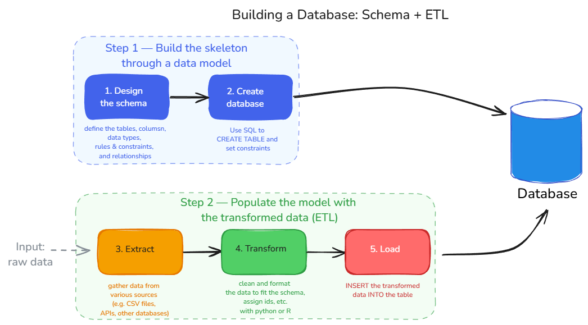
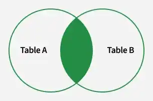
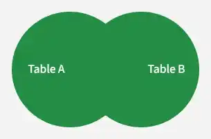
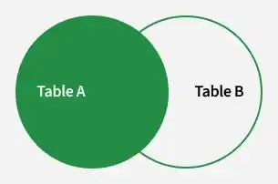
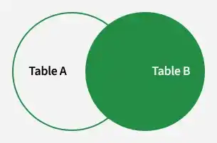
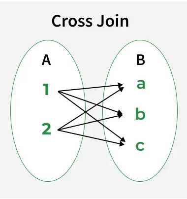

# Today

## Today: Querying

- Review the queries introduced in the previous lecture
- Combine tables with `JOIN`
- Write aggregate queries: `GROUP BY`, `COUNT`, `AVG`, `HAVING`
- If time 👓 CTEs and window functions


# Recap

## Two ways to look at data

{fig-align="center" width="100%"}


## The benefits of databases

{fig-align="center" width="90%"}


<!--

## The benefits of databases

#### Data management & integrity

- Store and organize data in a structured way.
- Enforce **data integrity** through constraints (`NOT NULL`, `CHECK`, keys, normalization, etc.).
- Guarantee **consistency**: every row follows the same rules at all times.

#### Data independence & shareability

- Data lives independently of any script or session.
- Multiple users can query the same database simultaneously.
- All access goes through the DBMS: no direct file editing.


#### Governance, reliability & security

- Provide mechanisms for backup, recovery, and access control.
- Ensure data is protected and available when needed.

#### Efficient access & scalability

- Optimized for fast querying on large volumes of data.
- Handle larger datasets more efficiently than in-memory structures.

> **Note:** See infographics in the [Appendix](#benefits_databases)

-->


## Relational model

- Data is organized in **tables** (relations) with rows (records) and columns (attributes).
- Each table has a **primary key** that uniquely identifies each record.
- Tables can be linked through **foreign keys**, allowing for complex relationships between data.


## Relational model

1. We used a relational model with a `countries` and a `trade_flows` table in the lecture.
2. We explored a star schema ⭐ with a fact table (`observations`) and dimension tables (`states`, `indicators`) in the exercises using FRED data.


## FRED data model using ER diagrams and mermaid 🧜‍♀️


::: {.columns}
::: {.column}

- `states` and `indicators` are **dimension tables**: they describe the entities being measured.
- `observations` is the **fact table**: it holds the measurements and references the dimensions via foreign keys.

```
states(state_id: INT PK, abbr: VARCHAR UNIQUE, name: VARCHAR, census_region: VARCHAR, census_division: VARCHAR)

indicators(indicator_id: INT PK, suffix: VARCHAR UNIQUE, title: VARCHAR, units: VARCHAR, frequency: VARCHAR)

observations(state_id: INT FK->states, indicator_id: INT FK->indicators, date: DATE, value: DOUBLE)
  PK: (state_id, indicator_id, date)
```
:::

::: {.column}
```{mermaid}
%%| echo: false

erDiagram
    STATES {
        int     state_id        PK
        varchar abbr
        varchar name
        varchar census_region
        varchar census_division
    }
    INDICATORS {
        int     indicator_id    PK
        varchar suffix
        varchar title
        varchar units
        varchar frequency
    }
    OBSERVATIONS {
        int    state_id      FK
        int    indicator_id  FK
        date   date
        double value
    }
    STATES       ||--o{ OBSERVATIONS : "measured in"
    INDICATORS   ||--o{ OBSERVATIONS : "recorded as"
```
:::
:::


## Constructing a database and the ETL process

{fig-align="center" width="100%"}

> **Note:** This graph is my own representation of the process. See the [Appendix](#etl_process) for the process in text.


## Write SQL queries with DuckDB from Python

##### Our Data Management System (DBMS) is the software that manages the database and allows us to interact with it using `SQL`.

::: {.fragment style="font-size: 0.8em;"}

#### We will use DuckDB

- built for analytics and research
- embedded (runs inside Python/R, no server)
- Reads CSV, Parquet, JSON directly
- One [.db]{.path} file, shareable

:::


::: {.fragment}

:::: {.columns style="font-size: 0.8em;"}

::: {.column width="65%"}
#### How it works in Python

- Open (or create) a database;
- Queries are passed as strings, and the result is a new table converted to a pandas DataFrame with `.df()`;
- Close the connection when done.

:::

::: {.column width="35%"}
<div style="margin-top: 1.5em;"></div>

```python
#| eval: false
import duckdb

# Create a connection to a .db file
conn = duckdb.connect("week_10/trade.db")

# Query
conn.execute("""
    SQL QUERY
""").df()

# Close the connection when done
conn.close()
```
:::
::::

:::

## SQL has five main purposes

::: {.fragment style="font-size: 0.8em;"}

#### Data Definition Language DDL

- Use `CREATE TABLE` to define the structure of a table (columns, data types, constraints).
- Use `ALTER TABLE` to modify the structure of an existing table (e.g. add a column). ⚠️

:::

<div style="margin-top: -1em;"></div>

::: {.fragment style="font-size: 0.8em;"}

#### Data Manipulation Language DML
- Use `INSERT INTO` to add data to the table, either row by row or in bulk.
- Use `UPDATE` to modify existing rows (based on a condition). ⚠️
- Use `DELETE` to remove rows based on a condition. ⚠️

:::

<div style="margin-top: -1em;"></div>

::: {.fragment style="font-size: 0.8em;"}

#### Data Query Language DQL
- Use `SELECT` to retrieve data from the database.

:::

<div style="margin-top: -1em;"></div>

::: {.fragment style="font-size: 0.8em;"}

#### Data Control Language DCL + Transaction Control Language TCL

:::

> ⚠️ Covered in the take-home exercise


## The basic query structure

A **query** is a request for specific information from the database. It takes one or more tables as input and returns a new table as output.

::: {.columns}
::: {.column}

<div style="margin-top: 2em;"></div>

SQL clauses always follow a specific order:

```sql
-- Comment: the basic structure of a SQL query
SELECT   column1, column2   -- which columns to return
FROM     table_name         -- which table
WHERE    condition          -- filter rows (optional)
ORDER BY column ASC/DESC    -- sort (optional)
LIMIT    n                  -- truncate output (optional)
;
```

<div style="margin-top: 1em;"></div>

- The database executes <br> `FROM` → `WHERE` → `SELECT` → `ORDER BY` → `LIMIT`.
- `SELECT` is written first but evaluated last.

:::
::: {.column}

](../../assets/img/lecture_09_db/sql_syntax.gif){width="70%"}

:::
:::


## The role of databases in your group project 🧑‍🎓👩‍🎓

- Principle: **all data flows from the database**. Your scripts should read from the database, not from raw files.
- Simulate a "firm" or "organization" environment where the data is shared to analysts (you 🫵) through queries.

#### Advantages
- All your analyses are based on the same cleaned and transformed data (consistency)
- You can easily update your results when new data comes in by simply reloading the database.
- ...


# Queries


## Let's work! {background-color="black" style="font-size: 0.9em;"}

1. Go on [https://www.cepii.fr/CEPII/en/bdd_modele/bdd_modele.asp](https://www.cepii.fr/CEPII/en/bdd_modele/bdd_modele_item.asp?id=37)
2. Download the "BACI" dataset (trade flows between countries) named "HS22".

  - This contains **bilateral trade flows for 200 countries at the product level** (5000 products) from 2022 to 2024.
  - Products use the “Harmonized System” nomenclature (6-digit codes).
3. Unzip the file in the [week_10/data]{.path} folder. You should have the following structure:
```
course_materials/
├── week_10/
│   ├── build_cepii_db.py
│   ├── data/
│   │   ├── BACI_HS22_V202601
│   │   │   ├── BACI_HS22_Y2022_V202601.csv
│   │   │   ├── BACI_HS22_Y2023_V202601.csv
│   │   │   ├── BACI_HS22_Y2024_V202601.csv
│   │   │   ├── country_codes_V202601.csv
│   │   │   ├── product_codes_HS22_V202601.csv
```

4. Initialize your environment using `uv init --python 3.13` and `uv add pandas duckdb skimpy `.
5. Open the `build_cepii_db.py` script and code along with me.


## Let's work! {background-color="black"}

- We will create a database from a real dataset and run queries on it.
- Open the python script and code along with me.
- This will be a more hands-on session, and we will cover more advanced queries than in the previous lecture.


## Extract and sketch the model {background-color="black"}

- Section `# ── EXTRACT ─────────────────────`
- Section `# ── Sketch ─────────────────────`


## CREATE our TABLEs

- Creating a table means defining its **schema**: the column names, their types, and any constraints.
- The schema is self-documenting: anyone reading it knows the rules.

It follows a simple syntax:

```sql
CREATE TABLE <table name> (
    <var name>  <var type> <constraint> ,
    <var name>  <var type> <constraint> ,
    ...
);
```

## Create tables, load data {background-color="black"}

- Section `# ── Create ─────────────────────`
- Section `# ── Load ─────────────────────`


## Queries: some useful operators and functions

<div style="margin-top: 1em;"></div>

#### `COUNT`, `*` and `UNION ALL`
- The `*` operator in `SELECT *` means "all columns".
- The `COUNT(*)` function counts the number of rows in the result, regardless of NULLs.
- `UNION ALL` combines results from two queries (keeping duplicates). `UNION` removes duplicates. It is like row binding in R or pandas.

<div style="margin-top: 1em;"></div>


## Query data {background-color="black"}

Section `── Queries  ─────────────`


## Some useful operators and functions

<div style="margin-top: 1em;"></div>

#### Strings
- String functions: `UPPER()`, `LOWER()`, `CONCAT()`, `SUBSTRING()`, etc.

```sql
SELECT CONCAT(name, ' (', region, ')') AS label FROM countries;
-- → 'Switzerland (Europe)'

SELECT SUBSTRING(name, 1, 3) AS code FROM countries;
-- → 'Swi'
```


## Some observations on SQL syntax

#### Queries
- All queries start with `SELECT` even if you don't want to select any column (e.g. `SELECT COUNT(*)`).
- Queries don't modify data: only `INSERT`, `UPDATE`, `DELETE` do

<div style="margin-top: 1em;"></div>

#### Formatting
- SQL ignores whitespace and line breaks: formatting is purely for readability
- Strings use single quotes ('states'), not double quotes
- All keywords are case-insensitive, but it is a common convention to write them in **CAPS** to distinguish them from column names.
- Column/table names are case-insensitive by default, but values are case-sensitive ('CA' ≠ 'ca')


# JOINS

## Joins

#### Bring columns from two tables together by matching keys (often a foreign **key**).

<div style="margin-top: 1em;"></div>

- In BACI, we have exporter codes; without a JOIN we only see numbers...

<div style="margin-top: 1.5em;"></div>

#### Different types based on how rows from two tables are matched and combined:

<div style="font-size: 0.8em;">

  - `INNER JOIN`: returns only matching rows from both tables
  - `LEFT JOIN`: returns all rows from the left table and matching rows from the right table (NULL if no match, useful to find gaps)
  - `RIGHT JOIN`: returns all rows from the right table and matching rows from the left table (NULL if no match)
  - `FULL OUTER JOIN`: returns all rows when there is a match in either left or right table (NULL if no match in either)

</div>

##### Remember the course data handling: same logic, different tools (SQL vs R)


## Common syntax

The most common join syntax in DuckDB follows this pattern:

```sql
SELECT *
  FROM table1 t1
  JOIN table2 t2
    ON t1.column = t2.column
```

<div style="margin-top: 0.5em;"></div>

- `JOIN ... ON`: the matching condition (the foreign key relationship)
- `t1`, `t2` are **table aliases**: shorthand written after the table name
- You can chain multiple `JOIN`s to reach all the dimensions you need

<div style="margin-top: 0.5em;"></div>


## Types of joins

::: {.columns}
::: {.column}
```sql
SELECT TableA.column1,
    TableB.column2,
    ....
  FROM TableA
  INNER JOIN TableB
    ON TableA.matching_column = TableB.matching_column;
```
:::
::: {.column}
<div style="margin-top: -1em;"></div>
{width="42%"}
:::
:::


::: {.columns}
::: {.column}
```sql
SELECT TableA.column1,
    TableB.column1,
    ....
  FROM TableA
  FULL JOIN TableB
    ON TableA.matching_column = TableB.matching_column;
```
:::
::: {.column}
<div style="margin-top: -1em;"></div>
{width="42%"}
:::
:::

> **Note:** `FULL JOIN` = `FULL OUTER JOIN` (the `OUTER` keyword is optional), `JOIN` = `INNER JOIN`.


## Right and left joins

::: {.columns}
::: {.column}
```sql
SELECT TableA.column1,
    TableB.column1,
    ....
  FROM TableA
  LEFT JOIN TableB
    ON TableA.matching_column = TableB.matching_column;
```
:::
::: {.column}
<div style="margin-top: -1em;"></div>
{width="42%"}
:::
:::

::: {.columns}
::: {.column}
```sql
SELECT TableA.column1,
    TableB.column1,
    ....
  FROM TableA
  RIGHT JOIN TableB
    ON TableA.matching_column = TableB.matching_column;
```
:::
::: {.column}
<div style="margin-top: -1em;"></div>
{width="42%"}
:::
:::


## Cross join

::: {.columns}
::: {.column}

#### `CROSS JOIN` creates a Cartesian product of two tables:

- returns every possible combination of rows from both tables.
- does not use a join condition
- the total number of rows in the result is the number of rows in the first table multiplied by the number of rows in the second table
- useful for generating all combinations of data
- dangerous 💣
:::
::: {.column}
<div style="margin-top: -1em;"></div>

:::
:::

<!-- https://www.geeksforgeeks.org/sql/sql-cross-join/-->


## Remember:

{width="100%"}


## Joining tables {background-color="black"}

Section `── JOINS  ─────────────`


# Group by and aggregation

## Summarize data with GROUP BY

##### `GROUP BY` collapses rows that share a value into a single **summary row**

- It is often used with aggregate functions (e.g. `COUNT`, `AVG`, `SUM`, `MIN`, `MAX`) to perform calculations on each group of data.
- Typical analytical questions: "how many per group?", "what's the average per group?", "what's the total per group?"


```sql
SELECT   region,
         COUNT(*) AS n_countries
FROM     countries
GROUP BY region
ORDER BY n_countries DESC
```

**⚠️ `SELECT` can only reference `GROUP BY` columns or aggregate functions (common error!)**


## GROUP BY: common aggregate functions

| Function | What it computes |
|---|---|
| `COUNT(*)` | Number of rows in the group |
| `AVG(col)` | Mean value |
| `SUM(col)` | Total |
| `MIN(col)` / `MAX(col)` | Extremes |


## Aggregation {background-color="black"}

Section `── GROUP BY  ─────────────`


## HAVING: filter on groups

`WHERE` filters **rows** (before grouping). `HAVING` filters **groups** (after grouping).

```sql
SELECT   exporter_id,
         SUM(value)     AS total_exports
FROM     flows
WHERE    year = 2022
GROUP BY exporter_id
HAVING   SUM(value) > 1000000
ORDER BY total_exports DESC
```

<div style="margin-top: 1em;"></div>

- If the condition uses an aggregate (`COUNT`, `AVG`, ...), it goes in `HAVING`. Everything else goes in `WHERE`.


## Filter on aggregations {background-color="black"}

Section `── HAVING ─────────────`


## The full query order

SQL clauses must appear in this order:

```sql
SELECT   ...          -- 6. choose output columns
FROM     ...          -- 1. which table(s)
JOIN     ... ON ...   -- 2. combine tables
WHERE    ...          -- 3. filter rows
GROUP BY ...          -- 4. group rows
HAVING   ...          -- 5. filter groups
ORDER BY ...          -- 7. sort
LIMIT    ...          -- 8. truncate
```

<div style="margin-top: 1em;"></div>

::: {.fragment}
##### The database executes FROM → JOIN → WHERE → GROUP BY → HAVING → SELECT → ORDER BY → LIMIT.
:::

::: {.absolute bottom=20 style="font-size: 0.75em; color: gray;"}
The numbers show execution order, not writing order. `SELECT` is written first but evaluated sixth, which is why you cannot use a `SELECT` alias in a `WHERE` clause.
:::


## 👓 Timing test duckdb vs pandas {background-color="black"}

Section `── TIMING ─────────────`


# 👓 Advanced

## CTES are reusable subqueries

A **Common Table Expression** names an intermediate result so you can reference it like a table.

```sql
WITH gdp_2020 AS (
    SELECT   c.name,
             c.region,
             o.value   AS gdp_per_capita
    FROM     observations  o
    JOIN     countries     c  ON o.country_id   = c.country_id
    JOIN     indicators    i  ON o.indicator_id = i.indicator_id
    WHERE    i.code = 'NY.GDP.PCAP.CD'
      AND    o.year = 2020
),
region_avg AS (
    SELECT   region,
             ROUND(AVG(gdp_per_capita), 0) AS avg_gdp
    FROM     gdp_2020
    GROUP BY region
)
SELECT * FROM region_avg
ORDER BY avg_gdp DESC
```

<div style="margin-top: 0.5em;"></div>

- Chain as many CTEs as you need, separated by commas
- Each CTE can reference the ones defined before it


## CTES can build on each other

](../../assets/img/lecture_10_queries/ctes.png){width="100%"}


## Advanced: CTE {background-color="black"}

Section `── CTE ─────────────`


# Window functions

## Window functions

- Perform calculations across a set of rows related to the current row, **without collapsing them into groups**
- Allow you to compute running totals, ranks, and other cumulative metrics while still keeping the individual row details
- Aggregation `OVER` a "window" of rows defined by `PARTITION BY` or `ORDER BY`


<div style="margin-top: 0.5em;"></div>

- `PARTITION BY`: restart the window for each partition (like `GROUP BY`, but rows stay separate)
- `ORDER BY` inside `OVER`: defines the sequence within each partition
- `LAG(col, n)`: value from `n` rows back; `LEAD(col, n)`: value from `n` rows ahead
- `ROW_NUMBER()`: sequential rank within each partition

::: {.absolute bottom=20 style="font-size: 0.75em; color: gray;"}
Other useful window functions: `RANK()`, `DENSE_RANK()`, `SUM(...) OVER (...)` for running totals.
:::


## Advanced: Window functions {background-color="black"}

Section `── Window Function ─────────────`


# Looking ahead

## What we covered today

<div style="margin-top: 0.5em;"></div>

- **Aggregation:** `GROUP BY`, `COUNT`, `AVG`, `SUM`, `HAVING`
- **JOINs:** `INNER JOIN` and `LEFT JOIN` to combine tables on foreign keys
- **CTEs:** `WITH` to build readable, reusable subqueries


## What you can now do

- Write a `SELECT` query with `WHERE`, `ORDER BY`, and `LIMIT`
- Combine tables using `INNER JOIN` and `LEFT JOIN` on a foreign key
- Write aggregate queries with `GROUP BY` and filter groups with `HAVING`
- Break a complex query into readable steps with a CTE

<div style="margin-top: 1em;"></div>


## Sources

- Simon Aubury & Ned Letcher, [*Getting Started with DuckDB*](https://github.com/PacktPublishing/Getting-Started-with-DuckDB) (Packt, 2024)
- Marco Venturini, *Data Handling: Databases* (HSG, 2025): DDL, constraints, ER diagrams
- DuckDB documentation: https://duckdb.org/docs/


# Appendix

## Summary: the benefits of databases {#benefits_databases}

](../../assets/img/lecture_10_queries/Advantages-of-Using-a-Database-an-infographic.png){width="100%"}


## Constructing a database and the ETL process {#etl_process}

1. 🦴 Set up the **skeleton** of the data through a data model.

    1. **Design the schema**: define the tables, columns, data types, constraints, and relationships.
    2. **Create the database**: use SQL commands to create the tables and set up constraints

<div style="margin-top: 1em;"></div>

2. Populate/**Load** the model with the **transformed** data (ETL)

    3. **E xtract**: gather data from various sources (e.g. CSV files, APIs, other databases).<br>
    4. **T ransform**: clean and format the data to fit the schema (e.g. handle missing values, convert data types, normalize). se python/R to clean and reshape your raw data, assign IDs, and prepare it for loading.
    5. **L oad**: insert the transformed data into the database using SQL commands or bulk loading


<!--
## NULL — the missing value {.added-by-claude}

`NULL` means *unknown* — it is not zero, not an empty string, not false.

```sql
-- Wrong: this silently drops all NULL rows
WHERE value != 100

-- Correct
WHERE value != 100 OR value IS NULL
```

<div style="margin-top: 0.5em;"></div>

Three things to know:

| Pattern | What it does |
|---|---|
| `IS NULL` / `IS NOT NULL` | Test for missing values |
| `COALESCE(value, 0)` | Replace NULL with a fallback |
| `COUNT(col)` vs `COUNT(*)` | `COUNT(col)` ignores NULLs; `COUNT(*)` counts all rows |

<div style="margin-top: 0.5em;"></div>

::: {.fragment}
```sql
-- Countries missing GDP data in 2020
SELECT   c.name
FROM     countries    c
LEFT JOIN observations o ON c.country_id   = o.country_id
                        AND o.indicator_id = 1
                        AND o.year = 2020
WHERE    o.value IS NULL
```
:::

::: {.absolute bottom=20 style="font-size: 0.75em; color: gray;"}
NULL propagates: `NULL + 1`, `NULL = NULL`, `NULL != NULL` are all NULL. The only safe test is `IS NULL`.
:::
-->