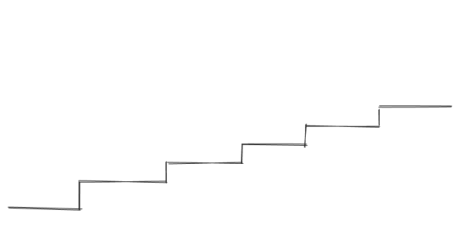
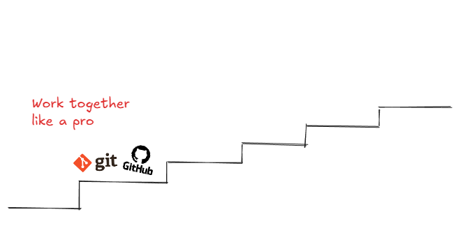
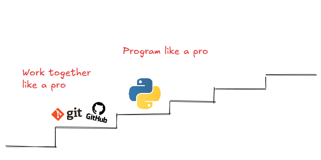
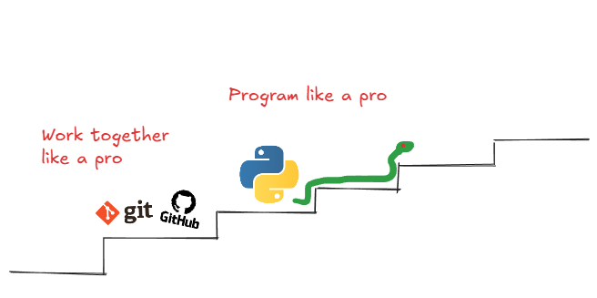
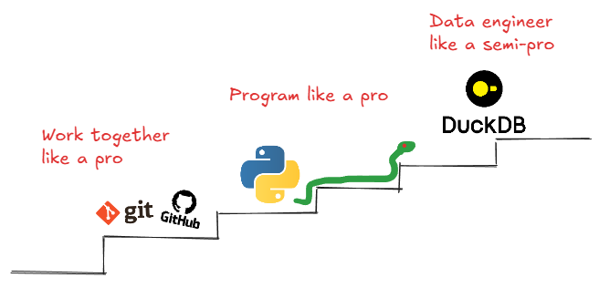
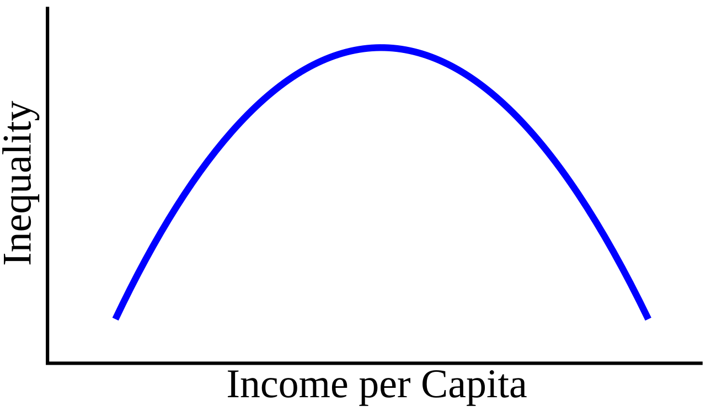
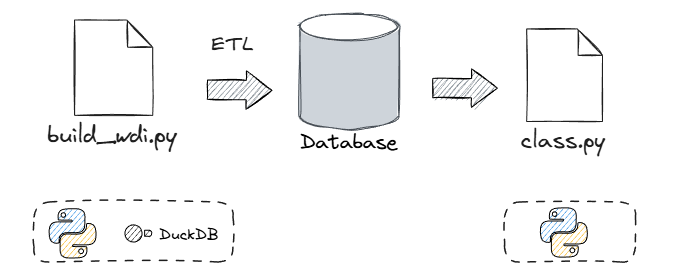
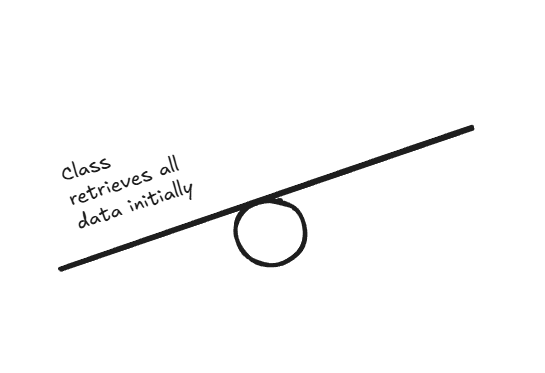
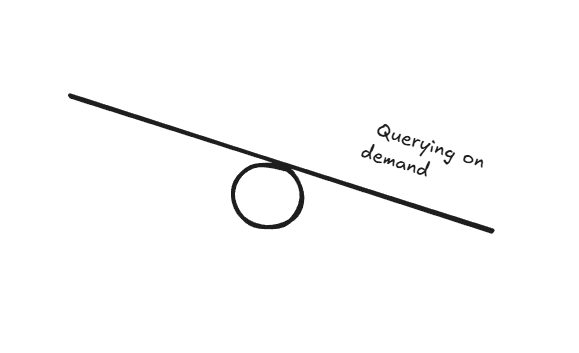

## Today

1. (Very) brief course recap
2. Information on examination
3. Course evaluation
4. Use case: Exploring Inequality

<div style="margin-top: 1em;"></div>


# A (very) brief course recap


## This course was about programming "the right way"

##### Program in a way that is reproducible, reusable and collaborative

- Produce code that works not just on your machine, but in settings like a research team or industry data job.
- Develop a **mindset**
- Similar to math, statistics, and Econ 101, develop a **toolkit** that will serve you in your studies and in your career 🧰


## The course



<!--
- Write **modular code**, **document functions**, implement **error handling**.
- Collaborate using **Git** and **version control**, manage shared code.
- Structure data in **relational databases** and query with **SQL** for systematic data workflows.
-->

## The course



## The course



## The course



## The course




## Iteration # 1

- Version `1.0` of this course
- We hope you found this course stimulating, valuable, and directly applicable to your studies/career
- For us, it has been an intense yet rewarding, engaging and fun experience


# Information on examination

## General remarks

- **Digital examination**, 60mn, during class on Friday, May 22nd.
- BYOD, make sure you bring your laptop charging cable 🔋
- The **lock-down browser must be installed before the exam**. For any questions, refer to StudentWeb.


## Structure

- **True/False questions**: one statement, decide if the statement is true or false.
- **Multiple correct**: one statement, 3-4 possible answers, decide which answers are correct.
- **Only one correct**: one statement, 3-4 possible answers, only one correct.
- **Essay questions** on the group project. A maximal word count is given (answers with higher word counts will have 10% points removed)

##### The type of the question is always indicated.


## What to expect and how to prepare

#### What to expect

- Questions on the course and exercises, focus on understanding and on the intuition you developed through practice (testing, coding, etc. )
- Slides noted with 👓 in lectures 9 and 10 are not exam relevant.
- You are not asked to write down code, but you must be able to interpret code that we give you.

#### How to best prepare

- If you solved the exercises, attended the lecture, and understood your group project, you are ready.
- Make sure you understand the key concepts.
- Since this is the first time we give the course, there is no mock exam available.
- **BUT:** we will be generous in the grading to account for this.


## Example: True-False question

*After running `git commit`, your changes are immediately visible to your teammates on GitHub.*

True or false

<div style="margin-top: 1em;"></div>

🔳 True

🔳 False


## Example: Multiple correct question

:::: {.columns}

::: {.column width="45%"}
```python
class BankAccount:
    def __init__(self, owner_name):
        self.owner_name = owner_name
        self.balance = 0

    def withdraw(self, amount):
        if amount <= self.balance:
            self.balance = self.balance - amount
            print(f"New balance: ${self.balance}")
        else:
            print("Withdrawal denied.")

    def deposit(self, amount):
        self.balance = self.balance + amount

# Example
my_account = BankAccount(owner_name="Franziska")
my_account.deposit(30)
my_account.withdraw(50)
my_account.deposit(100)
print(my_account.balance)
```
:::

::: {.column width="5%"}
:::

::: {.column width="50%"}


A) Every instance will have a balance of 0 initially.
B) If no value is provided for `owner_name` when creating an instance, it will be `None`.
C) After running the example code `my_account.balance` will be 80.
D) To increase the balance both methods `deposit()` and `withdraw()` can be used, because nothing prevents `amount` from being negative.

:::

::::


## Example: Only one correct question

*It does not matter whether I do a `LEFT JOIN` or an `INNER JOIN` from my fact table to a dimension table in a star schema where relational integrity holds.*

Only one correct.

<div style="margin-top: 1em;"></div>

A) The statement is incorrect: a `LEFT JOIN` always returns more rows than an `INNER JOIN`.
B) The statement is correct: relational integrity guarantees every row in the fact table has a matching row in the dimension table, so neither join drops rows.
C) The statement is incorrect: an `INNER JOIN` could silently drop rows from the fact table if a foreign key has no match in the dimension table.


## Example: Essay question

*In the group project, you were asked to use pull requests when working on github. Explain (1) how pull requests work, and (2) what are the advantages of using them, and (3) an example from your group project. Answer in max 70 words.*

<!--
Claude's answer ;-)

A pull request proposes merging a feature branch into main. Teammates review the code, leave comments, and approve before merging. This catches errors early and keeps main stable. In our project, we opened a PR for the database script; a teammate caught a missing FK constraint before merge.
-->


# Course evaluation

## Feedback

- Feel free to fill out the course evaluation form. Constructive feedback is welcome.
- Approach us if you would like to share feedback, and/or ideas for the next iteration.


# Use Case: Exploring Inequality


## Exploring Inequality

:::: {.columns}
::: {.column width="55%" style="font-size: 0.8em;"}

<div style="margin-top: 1em;"></div>

We use a dataset of World Bank indicators across countries and years to build two visualisations:

- **Kuznets curve** — Kuznets argued that as an economy develops, inequality **first rises, then falls**; we plot average Gini against log GDP per capita to see whether the pattern holds
- **Inequality ranking** — compare countries by their level of inequality for a given year, using either the Gini index or the decile ratio (top 10% / bottom 10% income share)

:::

::: {.column width="5%"}

:::

::: {.column width="40%"}



:::
::::


## Code structure





## Data: World Bank's World Development Indicators (WDI)

#### We get the data from the World Bank "Bulk Download"

1. On the [Worldbank Website](<https://datatopics.worldbank.org/world-development-indicators/>), click **Download > Bulk Download > CSV**.
2. The WDI bulk download contains all indicators in one `csv` archive. Unzip the archive into [week_11/data/]{.path}.

<!--(For research projects, the API is more convenient, but for the sake of this exercise, the bulk download is easier to work with.)-->
#### The database

- We provide the ready-made database [wdi.db]{.path}, you can use it directly
- We also provide [build_wdi.py]{.path}, the script used to create it, in case you are curious how the ETL process was done


## Design

The data is more "messy" than the CEPII dataset or the FRED dataset.

#### The entities:

- A **country** has an ISO code, a name, a region, and an income group
- An **indicator** has a WDI code, a name, a topic, and a unit
- An **observation** records one value for one country, one indicator, and one year

#### Classic 🌟 schema!


## The model

:::: {.columns}

::: {.column width="40%"}

<div style="margin-top: 2em;"></div>

<div style="font-size: 0.85em;">

- An observation *refers* to one **country** and to one **indicator** (FKs)
- There is no dimension table for year
- The combination (country, indicator, year) uniquely identifies one observation → composite primary key

</div>
:::

::: {.column width="60%"}

```{mermaid}
%%| echo: false
%%| fig-width: 5

%%{init: {
  "theme": "base",
  "themeVariables": {
    "primaryColor":       "#d4ece1",
    "primaryTextColor":   "#1a3a2a",
    "primaryBorderColor": "#006341",
    "lineColor":          "#006341",
    "background":         "#ffffff",
    "fontSize":           "19px"
  }
}}%%

erDiagram
    COUNTRIES {
        int     country_id PK
        varchar iso3
        varchar name
        varchar region
        varchar income_group
    }
    INDICATORS {
        int     indicator_id PK
        varchar code
        varchar name
        varchar topic
        varchar unit
    }
    OBSERVATIONS {
        int    country_id    FK, PK
        int    indicator_id  FK, PK
        int    year          PK
        double value
    }
    COUNTRIES    ||--o{ OBSERVATIONS : "measured in"
    INDICATORS   ||--o{ OBSERVATIONS : "recorded as"
```
:::
::::


## The Class

- A class that connects to the database and produces visualisations of inequality across countries
- We show three versions that differ in **how and when** they retrieve data from the database
- The core logic (querying, plotting) stays the same — only the connection strategy changes
- All examples are in [db_connection_examples.py]{.path}


## Querying data in classes

{fig-align="center" width=80%}

## Querying data in classes

{fig-align="center" width=80%}


# Good luck with the exam, and we hope to see you in the future!
