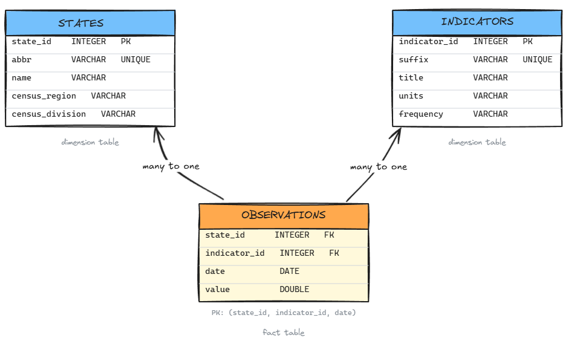

**Welcome to our last exercise session together!** In this exercise you build a relational database from scratch using FRED data.

We will use FRED data. Since you already know how to fetch series from FRED (Exercise 8) and you understand the structure of FRED data, we can really focus on the new materials today: **database design and SQL**.

The exercise follows the ETL pattern from lecture 9:

1. **Design** - sketch the schema before writing any code
2. **Extract & Transform** - fetch state-level series from FRED, reshape to fit the schema
3. **Load** - create the tables with `CREATE TABLE`, enforce constraints, insert data
4. **Query** - write `SELECT` / `WHERE` / `ORDER BY` queries

In Lecture 10, we will look at more advanced SQL commands such as JOINs, CTEs, and GROUP BY with basic summary functions in SQL.

---

# Exercise 0: Setup

Set up the environment and import the libraries using `uv`. You will need the packages `pandas`, `duckdb`, `python-dotenv`, and `fredapi`. In addition, I recommend installing `pyarrow` to read/write parquet files.

Load your FRED API key from the [.env]{.path} file and initialize the `Fred` client as in Exercise 8. Using the terminal, you can create your [.env]{.path} file with `echo "FRED_API_KEY=your_api_key_here" > .env`. The `dotenv` package loads variables from a [.env]{.path} file into the process environment so your code can read them with `os.getenv()`.

If you feel like it, you can also set up a repository on GitHub and work together with your colleagues.

```{python}
import os
import time
import pandas as pd
import duckdb
from pathlib import Path
from dotenv import load_dotenv
from fredapi import Fred

load_dotenv()

api_key = os.getenv("FRED_API_KEY")
fred = Fred(api_key=api_key)
```

---

# Exercise 1: Design the Schema

Before writing any code, we have to decide which data we will use, and how to structure them into a relational model. Today, we will work with three macroeconomic indicators for 20 US states (2000-2023) from FRED:

| FRED code pattern | Indicator | Unit | Frequency |
|---|---|---|---|
| `{ABBR}UR` | Unemployment Rate | % | Monthly |
| `{ABBR}NA` | Total Nonfarm Employment | Thousands | Monthly |
| `{ABBR}PCPI` | Per Capita Personal Income | USD | Annual |

The state abbreviation is prepended to the suffix to form the FRED series code: `CAUR` for California unemployment, `TXNA` for Texas employment, etc. We can work with simple string concatenations to get the data in a loop.

In this exercise, we decide to store all measurements in a **star schema** with two dimension tables (`states`, `indicators`) and one fact table (`observations`).

## 1.1 What is a star schema, and why use it here?

::: {.callout-note collapse="true" title="Solution"}
See slides from Lecture 9.

**What is a star schema:** The star schema is a common design for analytical databases. It has a central fact table that holds the measurements, and dimension tables that describe the entities being measured. The fact table references the dimension tables via foreign keys.

**Why use it here:** We have multiple indicators (unemployment, employment, income) that share the same dimensions (state and date). A star schema allows us to store all indicators in the same fact table, avoiding duplication of dimension data. It also makes it easier to add new indicators in the future without changing the schema.
:::

## 1.2 Draw the ER diagram

Draw an ER diagram for the three tables. Use a whiteboard or any tool you like, or try Mermaid syntax directly. Identify columns, types, primary keys and foreign keys.

*Hint: write down the model in text first.*

::: {.callout-note collapse="true" title="Solution"}

The written down model looks like this:

```
states(state_id: INT PK, abbr: VARCHAR UNIQUE, name: VARCHAR, census_region: VARCHAR, census_division: VARCHAR)

indicators(indicator_id: INT PK, suffix: VARCHAR UNIQUE, title: VARCHAR, units: VARCHAR, frequency: VARCHAR)

observations(state_id: INT FK->states, indicator_id: INT FK->indicators, date: DATE, value: DOUBLE)
  PK: (state_id, indicator_id, date)
```

We explicitly write the primary keys (PK) and foreign keys (FK) in the schema.

`states` and `indicators` are dimension tables: they describe the entities being measured. `observations` is the fact table: it holds the measurements and references the dimensions via foreign keys.

```{mermaid}
erDiagram
    STATES {
        int     state_id        PK
        varchar abbr
        varchar name
        varchar census_region
        varchar census_division
    }
    INDICATORS {
        int     indicator_id    PK
        varchar suffix
        varchar title
        varchar units
        varchar frequency
    }
    OBSERVATIONS {
        int    state_id      FK
        int    indicator_id  FK
        date   date
        double value
    }
    STATES       ||--o{ OBSERVATIONS : "measured in"
    INDICATORS   ||--o{ OBSERVATIONS : "recorded as"
```


or with a simple handwritten diagram:



- `states` and `indicators` are **dimension tables**. It is a wide table, where we could add more features about states (population, area, governor name) or indicators (source, description).
- `observations` is the **fact table**, a tidy long table.
- The composite primary key of `observations` is `(state_id, indicator_id, date)`: no duplicate measurement for the same state, indicator, and date.
- The foreign keys are `state_id` referencing `states(state_id)` and `indicator_id` referencing `indicators(indicator_id)` in `observations`. They link the fact table to the dimension tables.
- The foreign keys enforce **referential integrity**: you cannot have an observation for a state or indicator that does not exist in the dimension tables.

:::

---

# Exercise 2: Extract and Transform

The schema is now set and the design part is complete. We now need to move on to the **extract and transform** phase, where we fetch the data and reshape it to fit the three tables.

## 2.1 Configuration

We will fetch 20 states and 3 indicators. To make the process easier, we define the configuration as two lists of tuples: `STATES` and `INDICATORS`, and hardcode them. Each tuple contains the metadata for one state or indicator.

This is a simplification. In real life, we would also extract this information using `fred.get_series_info()` and additional cleaning. For a small set of known series, this is fine.

Create the following variables and the two lists in `Python`.

```{python}
DATE_START = "2000-01-01"
DATE_END   = "2023-12-31"

STATES = [
    # abbr, name,               census_region,  census_division
    ("CA", "California",        "West",         "Pacific"),
    ("OR", "Oregon",            "West",         "Pacific"),
    ("WA", "Washington",        "West",         "Pacific"),
    ("CO", "Colorado",          "West",         "Mountain"),
    ("AZ", "Arizona",           "West",         "Mountain"),
    ("TX", "Texas",             "South",        "West South Central"),
    ("FL", "Florida",           "South",        "South Atlantic"),
    ("GA", "Georgia",           "South",        "South Atlantic"),
    ("NC", "North Carolina",    "South",        "South Atlantic"),
    ("LA", "Louisiana",         "South",        "West South Central"),
    ("IL", "Illinois",          "Midwest",      "East North Central"),
    ("OH", "Ohio",              "Midwest",      "East North Central"),
    ("MI", "Michigan",          "Midwest",      "East North Central"),
    ("MN", "Minnesota",         "Midwest",      "West North Central"),
    ("MO", "Missouri",          "Midwest",      "West North Central"),
    ("NY", "New York",          "Northeast",    "Middle Atlantic"),
    ("PA", "Pennsylvania",      "Northeast",    "Middle Atlantic"),
    ("MA", "Massachusetts",     "Northeast",    "New England"),
    ("NJ", "New Jersey",        "Northeast",    "Middle Atlantic"),
    ("CT", "Connecticut",       "Northeast",    "New England"),
]

INDICATORS = [
    # suffix, title,                          units,       frequency
    ("UR",   "Unemployment Rate",             "%",         "Monthly"),
    ("NA",   "Total Nonfarm Employment",      "Thousands", "Monthly"),
    ("PCPI", "Per Capita Personal Income",    "USD",       "Annual"),
]
```

## 2.2 Build the dimension tables

Build two data frames `df_states` and `df_indicators` from the configuration lists shown above.

- As presented in our relational model, each data frame needs a sequential integer ID column (`state_id`, `indicator_id`) starting at 1 (and not at 0 🐍: SQL primary keys conventionally start at 1).

::: {.callout-note collapse="true" title="Solution"}
```{python}
# states
df_states = pd.DataFrame(STATES, columns=["abbr", "name", "census_region", "census_division"])
df_states = df_states.reset_index()                              # <1>
df_states = df_states.rename(columns={"index": "state_id"})      # <2>
df_states["state_id"] += 1                                       # <3>

print(f"{len(df_states)} states")
df_states.head()
```
1. Get the index into a regular column.
2. Rename it to `state_id`.
3. Add one to the index to avoid starting at 0.

```{python}
# indicators
df_indicators = pd.DataFrame(INDICATORS, columns=["suffix", "title", "units", "frequency"])
df_indicators = df_indicators.reset_index()
df_indicators = df_indicators.rename(columns={"index": "indicator_id"})
df_indicators["indicator_id"] += 1

print(f"{len(df_indicators)} indicators")
df_indicators
```
:::


## 2.3 Build the fact/observations table

Loop over all state x indicator combinations, fetch each series with `fred.get_series()`, and collect everything into a single long-format dataframe `df_observations` with columns `state_id`, `indicator_id`, `date`, `value`. Add `time.sleep(0.3)` between requests to avoid hitting the rate limit.

*Hint: build lookup dictionaries `abbr_to_id` and `suffix_to_id` from the dimension tables to avoid hardcoding IDs.*

::: {.callout-note}
If the FRED API is temporarily unavailable (as it was at some point when Aurélien prepared the exercises), a pre-fetched cache file is provided in the [week_09]{.path} folder. Install `pyarrow` first (`uv add pyarrow`), then load it directly:

```python
df_observations = pd.read_parquet("fred_cache.parquet")
```
:::

::: {.callout-note collapse="true" title="Solution"}

The `fred.get_series()` command below returns a `pandas.Series` indexed by date. It looks like this:

```
>>> raw
2000-01-01    42857.0
2001-01-01    45032.0
2002-01-01    44656.0
2003-01-01    44898.0
```
As presented in the ER diagram, we want a tidy long table with columns `state_id`, `indicator_id`, `date`, and `value`. We need to add the corresponding `state_id` and `indicator_id` for each row.

**Note**: in this particular exercise, there is no need to reshape the data (from wide to long or long to wide) since `fred.get_series()` already returns a long-format series. In other cases, you might need to reshape the data.

```{python}
#| eval: false
abbr_to_id   = df_states.set_index("abbr")["state_id"].to_dict()           # <1>
suffix_to_id = df_indicators.set_index("suffix")["indicator_id"].to_dict() # <1>

obs_frames = []                                                             # <2>

for state in STATES:                                                        # <3>
    abbr = state[0]                                                         # <3>
    for indicator in INDICATORS:                                            # <4>
        suffix    = indicator[0]                                            # <4>
        fred_code = abbr + suffix                                           # <5>

        raw = fred.get_series(                                              # <6>
            fred_code,
            observation_start=DATE_START,
            observation_end=DATE_END,
        )

        if raw is None or raw.empty:                                        # <7>
            print(f"  WARNING: {fred_code} - no data, skipping")
            continue

        df_chunk = raw.dropna().reset_index()                               # <8>
        df_chunk.columns = ["date", "value"]
        df_chunk["state_id"]     = abbr_to_id[abbr]
        df_chunk["indicator_id"] = suffix_to_id[suffix]
        df_chunk["date"]         = pd.to_datetime(df_chunk["date"])

        obs_frames.append(df_chunk[["state_id", "indicator_id", "date", "value"]])
        time.sleep(0.3)                                                     # <9>

df_observations = pd.concat(obs_frames, ignore_index=True)                 # <10>
print(f"Total: {len(df_observations):,} observations")
df_observations.head()
```
1. Build lookup dictionaries from abbreviation/suffix to integer ID.
2. Collect chunks first, then concatenate (appending to a DataFrame in a loop is slow).
3. Outer loop: iterate over states. `state[0]` is the abbreviation (`"CA"`, `"TX"`, ...).
4. Inner loop: iterate over indicators. `indicator[0]` is the suffix (`"UR"`, `"NA"`, `"PCPI"`).
5. Construct the FRED series code by concatenating abbreviation and suffix.
6. `fred.get_series()` returns a `pandas.Series` indexed by date.
7. Some combinations may not exist in FRED. This command skips them with a warning. You could also choose to insert missing rows with `value = NA` instead.
8. `reset_index()` turns the date index into a regular column. We also choose to drop missing values in the Extract phase. This might not always be the right choice, if missingness is meaningful.
9. Pause between requests to stay within the FRED rate limit.
10. Concatenate all chunks into one long DataFrame.

Note how we add indexes to the fact table in order to refer them using keys.
:::

```{python}
#| echo: false
CACHE_FILE = Path("fred_cache.parquet")

abbr_to_id   = df_states.set_index("abbr")["state_id"].to_dict()
suffix_to_id = df_indicators.set_index("suffix")["indicator_id"].to_dict()

if CACHE_FILE.exists():
    df_observations = pd.read_parquet(CACHE_FILE)
else:
    obs_frames = []
    for state in STATES:
        abbr = state[0]
        for indicator in INDICATORS:
            suffix    = indicator[0]
            fred_code = abbr + suffix
            raw = fred.get_series(
                fred_code,
                observation_start=DATE_START,
                observation_end=DATE_END,
            )
            if raw is None or raw.empty:
                continue
            df_chunk = raw.dropna().reset_index()
            df_chunk.columns = ["date", "value"]
            df_chunk["state_id"]     = abbr_to_id[abbr]
            df_chunk["indicator_id"] = suffix_to_id[suffix]
            df_chunk["date"]         = pd.to_datetime(df_chunk["date"])
            obs_frames.append(df_chunk[["state_id", "indicator_id", "date", "value"]])
            time.sleep(0.3)
    df_observations = pd.concat(obs_frames, ignore_index=True)
    df_observations.to_parquet(CACHE_FILE)
```

---

# Exercise 3: Build the Database

The three data frames are now in RAM-memory. We've now done the **extract** and **transform** phases: we have the data in three pandas DataFrames in memory. We are ready to move on to the **load** phase, where we create the database schema and load the data into it.

Following your ER diagram, create the schema and load the data directly.

## 3.1 Open a new database

In this exercise, we are first constructing the skeletton of our model: the (empty) tables and their relationships. Filling the model with data comes only later.

Use `duckdb.connect()` to create a new database file [fred_mini.db]{.path}. If the file already exists, delete it first to start with a clean slate.

<!-- @Aurélien: It would be helpful to say that we are first constructing the containers / tables and relationships - filling with data comes only later. I was looking for a reference to our data for quite a while until I realized that tables are populated only later. This was unexpected because unknown and is worth mentioning I believe, to reduce potential confusion. -->

::: {.callout-note collapse="true" title="Solution"}

Use `duckdb.connect()` to create the database. This is a file with extension `db`. You can delete it and recreate it at any point.

```{python}
DB_PATH = Path("fred_mini.db")
if DB_PATH.exists():
    DB_PATH.unlink()

conn = duckdb.connect(str(DB_PATH))
```
:::

## 3.2 Create the "states" table in your model

Use `CREATE TABLE states` to create the `states` table. Don't forget your diagram, which defined your columns, types, and constraints. Set "abbr" to unique since no two states share the same abbreviation.

```{python}
#| eval: false
conn.execute("""
    CREATE TABLE states (
        -- your columns here
    )
""")
```

::: {.callout-note collapse="true" title="Solution"}

<!-- @Aurélien: it is not clear why some columns get a "NOT NULL" or "UNIQUE" attribute while others (that at least at first glance also qualify for it) don't get it. That's quite confusing. The same applies for the indicators table. -->

```{python}
conn.execute("""
    CREATE TABLE states (
        state_id        INTEGER PRIMARY KEY,
        abbr            VARCHAR NOT NULL UNIQUE,
        name            VARCHAR NOT NULL,
        census_region   VARCHAR NOT NULL,
        census_division VARCHAR NOT NULL
    )
""")
```
:::

**Constraints:**

- `PRIMARY KEY`: uniquely identifies each row, never null
- `NOT NULL`: this column always has a value
- `UNIQUE`: no two states share the same abbreviation

Why do we want the columns in the dimension tables to be not null? Because, as dimensions, they identify the entities being measured. An entity without a linkable identifier (e.g. a state without an abbreviation) would not be useful in our model.

## 3.3 Create the "indicators" table

```{python}
#| eval: false
conn.execute("""
    CREATE TABLE indicators (
        -- your columns here
    )
""")
```

::: {.callout-note collapse="true" title="Solution"}

Use `CREATE TABLE indicators`.

```{python}
conn.execute("""
    CREATE TABLE indicators (
        indicator_id INTEGER PRIMARY KEY,
        suffix       VARCHAR NOT NULL UNIQUE,
        title        VARCHAR NOT NULL,
        units        VARCHAR,
        frequency    VARCHAR
    )
""")
```
:::

## 3.4 `CREATE TABLE observations`

Write the `CREATE TABLE` for `observations`. It must:

- Reference `states(state_id)` via a foreign key
- Reference `indicators(indicator_id)` via a foreign key
- Have a composite primary key on `(state_id, indicator_id, date)`

```{python}
#| eval: false
conn.execute("""
    CREATE TABLE observations (
        -- your columns here
    )
""")
```

::: {.callout-note collapse="true" title="Solution"}
```{python}
conn.execute("""
    CREATE TABLE observations (
        state_id     INTEGER NOT NULL REFERENCES states(state_id),
        indicator_id INTEGER NOT NULL REFERENCES indicators(indicator_id),
        date         DATE    NOT NULL,
        value        DOUBLE  NOT NULL,
        PRIMARY KEY (state_id, indicator_id, date)
    )
""")
```

DuckDB uses the `REFERENCES` keyword to define foreign keys. This automatically creates the constraint that `state_id` in `observations` must exist in `states(state_id)`, and similarly for `indicator_id`.

:::

## 3.5 Populate the database with the data

Use the `INSERT` command to insert the data from the three data frames into the corresponding tables.

::: {.callout-note collapse="true" title="Solution"}
DuckDB inserts directly from a pandas DataFrame in memory:

```{python}
conn.execute("INSERT INTO states        SELECT * FROM df_states")
conn.execute("INSERT INTO indicators    SELECT * FROM df_indicators")
conn.execute("INSERT INTO observations  SELECT * FROM df_observations")
```

Notice that DuckDB automatically applies the `SELECT *` to pandas DataFrames. It also maps pandas types to SQL types. The `date` column in `df_observations` is a `datetime64[ns]` in pandas, but it becomes a `DATE` type in DuckDB. This is a strength of DuckDB.

:::

## 3.6 Close the connection

After you're done with creating the database, close the connection.

::: {.callout-note collapse="true" title="Solution"}
```{python}
conn.close()
```

DuckDB has now updated the [fred_mini.db]{.path} file on disk with the new schema and data. You can open a new connection to it later to run queries.
:::


# Exercise 4: Explore the constraints

## 4.1 Foreign key constraints I

Re-open the database and try to insert an observation for `state_id = 999` using the `INSERT INTO` command. What error do you get?

::: {.callout-note collapse="true" title="Solution"}

```{python}
conn = duckdb.connect(str(DB_PATH))

# This works: state_id 1 exists in states
conn.execute("INSERT INTO observations VALUES (1, 1, '1999-01-01', 5.2)")

# This should fail
conn.execute("INSERT INTO observations VALUES (999, 1, '1999-01-01', 5.2)")
```

DuckDB raises:
```
ConstraintException: Violates foreign key constraint because key "state_id: 999" does not exist in the referenced table
```

Without the constraint this insert would silently succeed, leaving an observation pointing to a state that does not exist.
:::

## 4.2 Foreign key constraints II

Try to delete `state_id = 1` from `states`. What happens? How do you do it correctly?

::: {.callout-note collapse="true" title="Solution"}

```{python}
conn.execute("DELETE FROM states WHERE state_id = 1")
```

DuckDB raises:
```
ConstraintException: Violates foreign key constraint because key "state_id: 1" is still referenced by the observations table
```

Delete child rows first (the rows in the fact table), then the parent (the rows in the dimension table):

```{python}
conn.execute("DELETE FROM observations WHERE state_id = 1")  # child first
conn.execute("DELETE FROM states       WHERE state_id = 1")  # parent after
```

> **Note:** California (`state_id = 1`) is now gone from your database. IDs do not shift after a `DELETE`: Oregon stays at `state_id = 2`, Washington at `state_id = 3`.

:::

## 4.3 Clean up the inserted test row and close the connection

::: {.callout-note collapse="true" title="Solution"}

```{python}
conn.execute("DELETE FROM observations WHERE date = '1999-01-01'")
```

```{python}
conn.close()
```
:::

---

# Exercise 5: Explore and Query

## 5.1 Open the database
This time, connect to the database in read-only mode since we only want to run queries and avoid accidental modifications. To connect without write permissions, use `read_only=True`. This prevents accidental modifications and allows multiple concurrent connections.

::: {.callout-note collapse="true" title="Solution"}

```{python}
conn = duckdb.connect(str(DB_PATH), read_only=True)
```
:::

## 5.2 Explore the schema

Use the `SHOW TABLES` command to list the tables in the database, and `DESCRIBE` to see the columns and constraints of each table. Comment.

::: {.callout-note collapse="true" title="Solution"}

The `SHOW TABLES` command lists all tables in the database. It is DuckDB-specific, but other databases have similar commands (e.g. `SHOW TABLES` in MySQL, `\dt` in PostgreSQL).

```{python}
conn.sql("SHOW TABLES")
```

The `DESCRIBE` command shows the columns, types, and constraints of a table. It is also DuckDB-specific. In other databases, you might need to query the information schema or use a GUI tool to see the schema. We convert the result to a pandas data frame using `.df()` for better readability.

```{python}
conn.execute("DESCRIBE states").df()
```

```{python}
conn.execute("DESCRIBE indicators").df()
```

```{python}
conn.execute("DESCRIBE observations").df()
```

You can also use the following query to find the foreign keys:

```{python}
conn.execute("""
    SELECT table_name, constraint_type, constraint_column_names,
           referenced_table, referenced_column_names
    FROM duckdb_constraints()
    WHERE constraint_type = 'FOREIGN KEY'
""").df()
```

:::

## 5.3 How many rows in each table?

How many rows in each table? Use the `COUNT(*)` aggregate function. You can run three separate queries, or combine them with `UNION ALL` to get all counts in one table.

::: {.callout-note collapse="true" title="Solution"}

One way is to single out each table and run a separate `SELECT COUNT(*)` query.

- `COUNT(*)` counts all rows (`*`), while `COUNT(column)` counts only rows in that column.
- `AS n` gives a name to the count column in the output. It is not necessary, but makes the naming and the output more readable.

```{python}
conn.execute("""
    SELECT COUNT(*) AS n
    FROM states
""").df()
```
```{python}
conn.execute("""
    SELECT COUNT(*) AS n
    FROM indicators
""").df()
```
```{python}
conn.execute("""
    SELECT COUNT(*) as n
    FROM observations
""").df()
```

Alternatively, you can combine the three counts into a single query with `UNION ALL`:

- `UNION ALL` combines the results of multiple `SELECT` statements into a single result set. It is useful here to get all counts in one table.
- A "string" variable in the `SELECT` function (like `SELECT 'states'`) creates a column with the same (string) value for all rows.

```{python}
conn.execute("""
    SELECT 'states'
        ,COUNT(*) AS n
    FROM states

    UNION ALL

    SELECT 'indicators'
        ,COUNT(*)
    FROM indicators

    UNION ALL

    SELECT 'observations'
        ,COUNT(*)
    FROM observations
""").df()
```

:::

# Exercise 6: Make basic queries

Before we start, you noted some specificities in SQL queries:

- All queries start with `SELECT` even if you don't want to select any column (e.g. `SELECT COUNT(*)`).
- SQL ignores whitespace and line breaks: formatting is purely for readability
- Strings use single quotes ('states'), not double quotes
- All keywords are case-insensitive, but it is a common convention to write them in uppercase to distinguish them from column names and make the query more readable.
- Column/table names are case-insensitive by default, but values are case-sensitive ('CA' ≠ 'ca')
- Queries don't modify data: only `INSERT`, `UPDATE`, `DELETE` do


## 6.1 List all states in the Northeast

Return the **name** and **census_division** of all states in the `Northeast` census region, sorted alphabetically by name.

::: {.callout-note collapse="true" title="Solution"}
```{python}
conn.execute("""
    SELECT name, census_division
    FROM   states
    WHERE  census_region = 'Northeast'
    ORDER BY name
""").df()
```

In plain text: we select the variables `name` and `census_division` from the `states` table, but only for rows where `census_region` is equal to `Northeast`. We also sort the results alphabetically by `name`.
:::

## 6.2 Which state comes last alphabetically in the Midwest?

Return the single state in the `Midwest` region that comes last alphabetically.

::: {.callout-note collapse="true" title="Solution"}
```{python}
conn.execute("""
    SELECT name, census_division
    FROM   states
    WHERE  census_region = 'Midwest'
    ORDER BY name DESC
    LIMIT 1
""").df()
```

- `LIMIT 1` returns only the first row of the result set, which is the state that comes last alphabetically due to `ORDER BY name DESC`. `LIMIT` is supported by most databases (PostgreSQL, MySQL, SQLite, DuckDB), but not by Oracle.
- `ORDER BY name DESC` sorts the results in reverse alphabetical order. The default behavior is `ASC` (ascending).

In plain text: we select the variables `name` and `census_division` from the `states` table, but only for rows where `census_region` is equal to `Midwest`. We sort the results in reverse alphabetical order by `name`, and return only the first row (the last state alphabetically).
:::

## 6.3 Query the following from the fact table `observations`

1. Unemployment in Oregon in 2020
2. Which state had the highest unemployment in January 2020?
3. Highest unemployment ever recorded for Washington

Once you're done, close the connection.


::: {.callout-note collapse="true" title="Solution"}

**Making sense of the IDs** The queries will return numeric IDs. To get readable names you need a JOIN with the dimension tables. We will see this in Week 10.

Check `df_indicators` and `df_states` in pandas to map IDs to names:

```{python}
print(df_indicators)
print(df_states)
```

- Oregon has `state_id = 2`, and Washington has `state_id = 3`.
- Unemployment Rate has `indicator_id = 1`.


**Unemployment in Oregon in 2020**
Return all unemployment observations (`indicator_id = 1`) for `state_id = 2` (Oregon) in 2020, sorted by date. Remember, we deleted the State 1 in the exercise above...

```{python}
conn.execute("""
    SELECT date, value
    FROM   observations
    WHERE  indicator_id = 1
      AND  state_id = 2
      AND  EXTRACT(YEAR FROM date) = 2020
    ORDER BY date
""").df()
```

`EXTRACT(YEAR FROM date)` extracts the year from a `DATE` column. This is standard SQL.


**States with the highest unemployment in January 2020**
Return the `state_id` and `value` for the state with the highest unemployment rate on `2020-01-01`.

```{python}
conn.execute("""
    SELECT state_id, date, value
    FROM   observations
    WHERE  indicator_id = 1
      AND  date = '2020-01-01'
    ORDER BY value DESC
    LIMIT 1
""").df()
```

You get a `state_id`. It should be `5` for Arizona.


**Highest unemployment ever recorded for Washington**

Return the single row with the highest unemployment value for `state_id = 3` (Washington).

```{python}
conn.execute("""
    SELECT date, value
    FROM   observations
    WHERE  indicator_id = 1
      AND  state_id = 3
    ORDER BY value DESC
    LIMIT 1
""").df()
```

```{python}
conn.close()
```

:::

---

# Exercise 7: A New Data Series (🔎 self-study)

This exercise is more advanced and we do not expect you to know all the commands used here. Its purpose is to show you how flexible schemas are when adding data from other sources. Hint: might be useful for your group project...

Imagine the following situation: you want to add data from the OECD to your existing data model. An OECD analyst sends you the Regional Well-Being Index for four states, years 2019-2022:

```{python}
df_oecd = pd.DataFrame({
    "state_name": ["Oregon", "Texas", "New York", "Florida"] * 4,
    "year":        sorted([2019, 2020, 2021, 2022] * 4),
    "value":       [6.8, 6.4, 6.9, 6.5,
                    6.5, 6.1, 6.7, 6.3,
                    6.7, 6.3, 6.8, 6.4,
                    6.9, 6.5, 7.0, 6.6],
})
df_oecd
```

This is of course a simplified example with a made-up dataset, but it is realistic in the sense that you often get data in a different format than your existing data, and you need to fit it into your existing schema. In real life, you would import a .csv or run a query.

Add this series to your database. Make the necessary changes in your schema.

## 7.1 Open the connection

```{python}
conn = duckdb.connect(str(DB_PATH))
```

## 7.2 Questions to ask yourself before writing any code:

1. Think about your schema and your diagram. Where does this new series fit? Do you need to change the schema?
2. What SQL commands do you need to use to update the schema and insert the new data?

*Hint:* You might want to add a new column to `indicators` to keep track of the source of each indicator (FRED vs OECD). This is a common practice in data engineering: adding metadata to keep track of data provenance.


::: {.callout-note collapse="true" title="Solution"}

**Your schema**: The advantage of your star schema is its flexibility.

- All facts are stored in a single long table. You simply need to append your new data to the fact table by adding rows (rowbind).
- The dimensions are stored in separate tables. You can add the new indicator by adding a row  to the `indicators` table.
- The schema does not change and we don't need to add tables.

**SQL commands**: You will need to use `ALTER TABLE` to add a new column to `indicators`, `UPDATE` to backfill existing rows, and `INSERT INTO` to add the new indicator and the new observations.

- The difference between `ALTER TABLE` and `UPDATE` is important: `ALTER TABLE` changes the structure of the table (adding a new column), while `UPDATE` changes the data in existing rows (setting the value of the new column for existing indicators).

:::

## 7.3 Extract and Transform

The first step is to transform the `df_oecd` data frame to fit the structure of the `observations` table:

- The OECD data uses full state names. Your `observations` table stores `state_id` integers.
- Build a dictionary `name_to_id` from the `states` table, then add `state_id` and `indicator_id` columns to `df_oecd`.

::: {.callout-note collapse="true" title="Solution"}

```{python}
name_to_id = (
    conn.execute("SELECT state_id, name FROM states").df()
    .set_index("name")["state_id"]
    .to_dict()
)

df_oecd["state_id"]     = df_oecd["state_name"].map(name_to_id)
df_oecd["indicator_id"] = 4
df_oecd["date"]         = pd.to_datetime(df_oecd["year"].astype(str) + "-01-01")

df_oecd = df_oecd[["state_id", "indicator_id", "date", "value"]]
df_oecd
```
:::


## 7.4 Update the schema and insert the new indicator

Open the database in write mode. Add a `source` column to `indicators`, set existing rows to `'FRED'`, then insert the WBI indicator with `source = 'OECD'`.

::: {.callout-note collapse="true" title="Solution"}

- The `ALTER TABLE` command is used to change the structure of an existing table. Its syntax is `ALTER TABLE table_name ADD COLUMN column_name data_type`. This adds a new column to the table. Existing rows will have `NULL` in this new column until we update them.
- The `UPDATE` command is used to modify existing rows in a table. Its syntax is `UPDATE table_name SET column_name = value WHERE condition`. This sets the `source` column to `'FRED'` for all existing indicators.
- The `INSERT INTO` command is used to add new rows to a table. Its syntax is `INSERT INTO table_name (columns) VALUES (values)`. This adds a new indicator for the WBI with the source set to `'OECD'`.

```{python}
conn.execute("ALTER TABLE indicators ADD COLUMN source VARCHAR")

conn.execute("UPDATE indicators SET source = 'FRED'")

conn.execute("""
    INSERT INTO indicators (indicator_id, suffix, title, units, frequency, source)
    VALUES (4, 'WBI', 'Regional Well-Being Index', 'Index (0-10)', 'Annual', 'OECD')
""")

conn.execute("SELECT * FROM indicators").df()
```

:::


## 7.5 Load: insert the observations

Insert `df_oecd` into `observations` and verify with a `SELECT`.

::: {.callout-note collapse="true" title="Solution"}
```{python}
conn.execute("INSERT INTO observations SELECT * FROM df_oecd")

conn.execute("""
    SELECT *
    FROM   observations
    WHERE  indicator_id = 4
    ORDER BY state_id, date
""").df()
```

The new series is now in the same `observations` table as the FRED data. Adding a fifth indicator follows the same two steps: one row in `indicators`, then INSERT the observations.
:::

```{python}
conn.close()
```
